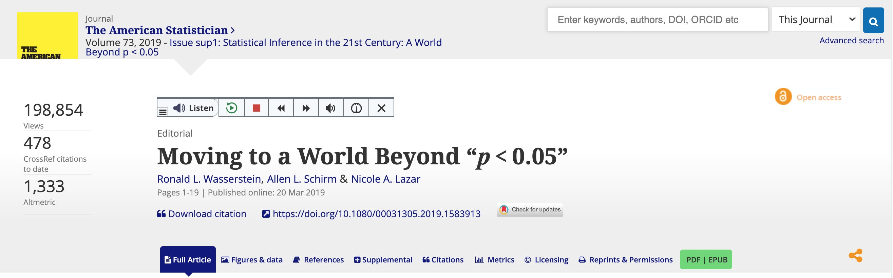
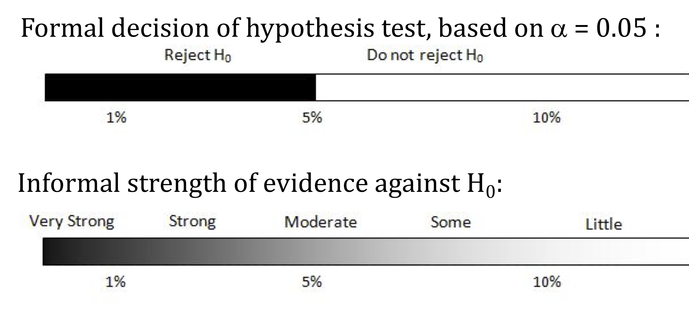

```{r setup, include=FALSE}
knitr::opts_chunk$set(echo = TRUE,message=FALSE,warning=FALSE)
```


```{r, echo=F,message=FALSE}
library(mosaic)
library(Lock5Data)
```

# p-value and $H_0$  

* If the p-value is small, then a statistic as extreme as that observed would be unlikely if the null hypothesis were true, providing significant evidence against $H_0$.

--

* The *smaller* the p-value, the *stronger* the evidence against the null hypothesis and in favor of the alternative.

---

# Formal Decisions

### If the $p$-value is small:

* **Reject $H_0$**
* the sample would be **extreme** if $H_0$ were true
* the results are **statistically significant**
* we have evidence for $H_a$

--

### If the $p$-value is **not** small:

* **Do not reject $H_0$**
* the sample would not be too extreme if $H_0$ were true
* the results are **not statistically significant**
* the test is **inconclusive**; either $H_0$ or $H_a$ may be true

--

But how small is small?

---

# Significance Level

The **significance level $\alpha$** is the  threshold *below* which the $p$-value is deemed small enough to reject the null hypothesis.

+ $p$-value $<\alpha$ $\Longrightarrow$ Reject $H_0$

+ $p$-value $\ge \alpha$ $\Longrightarrow$ Do not reject $H_0$

The most common value of $\alpha$ is .05

* Values of .10 and .01 are also common.
  
---
  
# Significance Level

* $p$-value $<\alpha$ $\Longrightarrow$ Results are **statistically significant**
    + Reject $H_0$ in favor of $H_a$
    
--
  
* $p$-value $\ge\alpha$ $\Longrightarrow$ Results are **not statistically significant**
    + Test is inconclusive

---
# Components of a Hypothesis Test

### A formal hypothesis test includes the following components:

1. State the null and alternative hypotheses (defining parameters when necessary).
--

2. Determine the value of the observed sample statistic.

--

3. Find the $p$-value.

--

4. Make a generic decision about $H_0:$ Reject $H_0$ or do not reject $H_0$.

--

5. Write a sentence explaining the conclusion of the test in context, indicating whether or not we have convincing evidence for $H_a$ and referring back to the question of interest.

---
class: middle, center,inverse

# Significance Testing is Controversial

---
background-image: url(https://imgs.xkcd.com/comics/mathematical_symbol_fight.png)

---
class: top

# Moving to a World Beyond $p<0.05$



* [Link](https://doi.org/10.1080/00031305.2019.1583913) to the article 


---

# P-value, Significance Levels, and Decisions


---

# Statistical Conclusions  




---
# Never Accept the Null

* "Do not reject $H_0$" is not the same as "accept $H_0$"!

*  Lack of evidence against $H_0$ is **not** the same as evidence for $H_0$!

