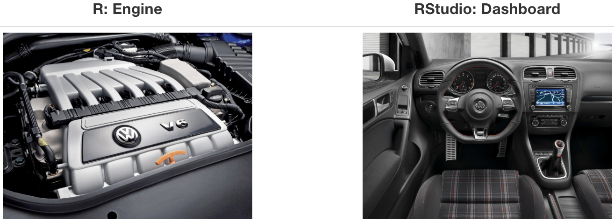

# 1. Welcome

This tutorial takes you through the steps to get R and RStudio up and running on your Windows PC or Mac.

::: callout-tip
## ▶ Watch the screencast

Prefer to follow along on video? This entire tutorial is also available as a screencast: [**click here to watch**](SCREENCAST-LINK-TBD). Feel free to keep this page open and pause the video as you go.
:::

{alt="R logo" width="75"} is the statistical programming language.

{alt="RStudio logo" width="10%"} is the IDE (Integrated Development Environment).

The figure below provides a visual representation of the relationship between R and RStudio. R is the engine that drives our calculations while RStudio is the interactive environment we use to interact with R.

```{r fig.align="center", echo=FALSE}

```

Source: <http://moderndive.com>

The remainder of this tutorial will lead you through the steps to install R and the RStudio IDE. These steps apply whether you have a Mac or a Windows PC.

::: callout-important
If you don't have a Windows or Mac lapto but instead use an **iPad or** **Chromebook**, please email me as soon as possible so we can set up browser-based access. That option may take a couple extra days to arrange so please let me know earlier rather than later.
:::

# 2. Installing R and RStudio

R and RStudio are two separate pieces of software so two separate installations are required.Follow the two steps below **in order** to bet **both** installed on your computer.

> Install R first, then RStudio. RStudio is just the dashboard; it needs the R engine installed on your computer to work.

**Step 1: Install R**

Go to <https://cran.r-project.org/> and click the link for your operating system:

- **Windows:** "Download R for Windows" → "base" → the big **Download R-4.6.1 for Windows** link.
- **Mac:** "Download R for macOS" → choose the `.pkg` file that matches your Mac:
  - **Apple Silicon** (M1/M2/M3/M4 — most Macs bought since late 2020): the `R-4.6.1-arm64.pkg` link.
  - **Intel Mac** (older): the `R-4.6.1-x86_64.pkg` link.
  - Not sure which chip you have? Apple menu → **About This Mac** and look for "Chip" or "Processor."

Run the installer with all default options. You do not need to open the R application itself when it's done. We'll always just launch RStudio, which uses R as the engine automatically in the background.

**Step 2: Install RStudio Desktop**

Go to [https://posit.co/downloads](https://posit.co/downloads) and click **Download** under **RStudio Desktop** (the free, Open Source edition, not RStudio Server or a paid Pro/Team edition). This takes you to a page with direct download links; pick the file for your system (Windows `.exe` or macOS `.dmg`) and run the installer with default options.

**Mac security note:** if you see "cannot be opened because the developer cannot be verified," go to **System Settings → Privacy & Security**, scroll down, and click **Open Anyway** next to the RStudio message.

**Step 3: Confirm it worked**

Open RStudio (not R itself). You should see several panes, including a **Console** pane (usually bottom-left) with a `>` prompt. Click into the Console, type `R.version.string`, and press **Enter**. You should see something like `"R version 4.6.1 (2026-06-24)"`. If RStudio opens and this runs without an error, R and RStudio are installed correctly, and RStudio has found your R installation automatically.

Install the **most recent version of the software that is compatible with your computer**, which may be newer than the version numbers above — as of writing (August 2026), the latest R release is 4.6.1 and the latest RStudio is 2026.08.1. If you have any questions at this stage, feel free to reach out to me.

# 3. Installing R Packages

Next you'll install a few R *packages*. R packages are collections of functions and data sets developed by R users that increase the power of R by improving existing base R functions, adding new functions, or bundling multiple datasets into a convenient "package."

This course uses a few add-on packages beyond base R. In RStudio, click into the **Console** pane (bottom-left, with the `>` prompt), paste the line below, and press **Enter**:

``` r
install.packages(c("mosaic", "ggformula", "Lock5Data"))
```

This may take a minute or two and will print a lot of text. That just means it's working. If you're asked whether to install from source or to compile packages that need updating, it's fine to choose **No**. We'll install a few additional packages later in the term as we need them.

Package installation is a **one-time** operation. Once a package is installed, you don't need to re-install it each time you use R — but you do need to "load" it at the start of each session. The homework templates you'll use already include the lines that do that for you.

## Verify everything works

Still in the Console, type the following and press **Enter**:

``` r
library(mosaic)
```

If you see some introductory messages but no red **Error** text, you're all set. If you instead see `Error in library(mosaic) : there is no package called 'mosaic'`, go back and re-run the `install.packages()` line above.

# 4. Troubleshooting

- **Installer blocked by your computer's security settings?** Right-click the installer and choose **Open**, or check your Downloads folder settings. (On a Mac, see the security note in Step 2 above.)
- **Package installation fails with a compiler error (Mac)?** You likely need Xcode Command Line Tools — RStudio will usually prompt you to install these automatically the first time you need them.
- **Still stuck?** Bring your laptop to office hours or email me a screenshot of the error — this is a very common first-week hiccup and easiest to fix in person. Even better sometimes is just to reach out on Teams and we can work through it together.

# 5. Next Steps

Now that you've completed these installations, you're ready to go. If you ran into problems or have questions, please contact me by Teams or email.
