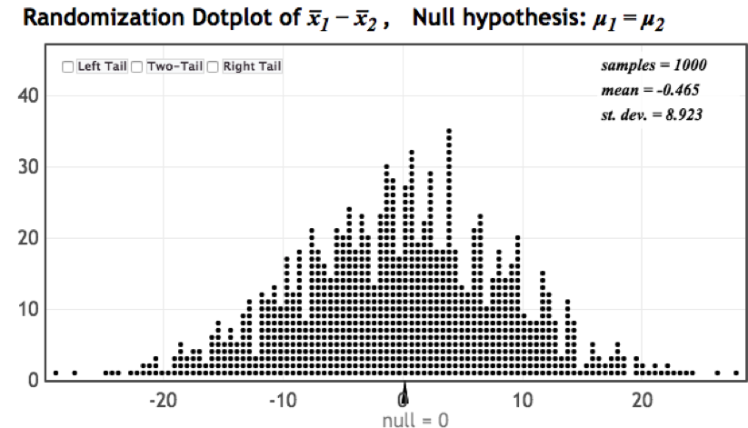

```{r, echo=F,message=FALSE}
library(mosaic)
library(Lock5Data)
```

# Key Questions

:question: How unusual is it to see a sample statistic as extreme as that observed, if $H_0$ were true?

-   If it is very unusual, we have statistically significant evidence against the null hypothesis

:point_right: But *how* do we **measure** how unusual a sample statistic is, if $H_0$ were true?

## Quantifying Evidence Against the Null Hypothesis

:bulb: To see if a statistic provides evidence against $H_0$, we need to explore...

::: incremental
-   what kind of sample statistics we would observe\
-   just by *random chance*\
-   **if** $H_0$ were true.\
:::

::: notes
Spinning pennies 20 times and count number of heads. Randomization distribution
:::

## Randomization Distribution

-   A **randomization distribution** is a collection of statistics from samples simulated assuming the null hypothesis is true

-   The randomization distribution shows what values of statistics would be observed, just by random chance, *if the null hypothesis were true*

{.absolute bottom=0 right=50 height="300"}

## Key Question

:question: How unusual is it to see a sample statistic as extreme as that observed, if $H_0$ is true?

:::{.incremental}
-   A **randomization distribution** tells us what values of statistics we would see just by random chance, *if the null hypothesis were true*

-   Use the distribution to assess how extreme the observed statistic is!
:::

## p-value

:pencil2: The $p$-value is the chance of obtaining a sample statistic as extreme (or more extreme) than the observed sample statistic, *if the null hypothesis were true*

::: fragment
**Calculate** the $p$-value as the proportion of statistics in a randomization distribution that are as extreme (or more extreme) than the observed sample statistic
:::

## Calculating a p-value

1.  What kinds of statistics would we get, just by random chance, if the null hypothesis were true?

    :white_check_mark: Randomization distribution

::: fragment
2.  What proportion of these statistics are as extreme as our original sample statistic?

    :white_check_mark: $p$-value
:::

## Alternative Hypothesis

-   A one-sided alternative contains either $>$ or $<$

-   A two-sided alternative contains $\neq$

-   The $p$-value is the proportion **in the tail in the direction specified by** $H_a$

-   For a two-sided alternative, the $p$-value is **twice the proportion in the smallest tail**

## Estimating a P-value from a Randomization Distribution

-   **One-tailed alternative**: Find the proportion of randomization samples that **equal or exceed** the original statistic in the direction (tail) indicated by the alternative hypothesis.

::: fragment
-   **Two-tailed alternative**: Find the proportion of randomization samples in the smaller tail **at or beyond the original** statistic and then **double the proportion** to account for the other tail.
:::

## Guidelines for Thinking About P-values

When wording conclusions from a test of significance, you can consider:

::: incremental
-   $.05\le p \le .10 \implies$ *slight* evidence

-   $.01\le p \le .05 \implies$ *some* or *moderate* evidence

-   $p \le .01 \implies$ *strong* or *convincing* evidence
:::

## Summary

::: incremental
-   The randomization distribution shows what types of statistics would be observed, just by random chance, *if the null hypothesis were true*.

-   A $p$-value is the chance of getting a statistic as extreme as that observed, *if* $H_0$ were true.

-   A $p$-value can be calculated as the proportion of statistics in the randomization distribution *as extreme or more extreme than the observed sample statistic*.

-   The smaller the *p*-value, the greater the evidence against $H_0.$
:::
