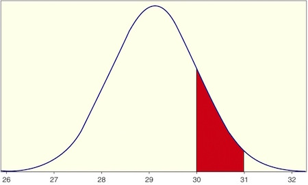

```{r setup, include=FALSE}
knitr::opts_chunk$set(echo = TRUE,message=FALSE,warning=FALSE)
```


```{r, echo=F,message=FALSE}
library(mosaic)
library(Lock5Data)
```

# Outline

* Density curves  
* Normal distribution  
* Finding normal probabilities  
* Backward normal calculations   
* The standard normal distribution  

---

# Density Curve

A **density curve** is

* A theoretical model to describe a variable’s distribution

* An idealized histogram
    
---

# Characteristics of density curves

Characteristics of density curves

* Total area under the curve = 1 (or 100%)

* The proportion of the population in any interval is the **area** under the curve over that interval.

```{r, out.height ="300px",echo=FALSE,fig.align='center'}

```


---

# Normal Distribution

* A **normal distribution**  has a *symmetric, single-peaked, and bell-shaped* density curve.

--

* Normal distributions are completely characterized by their mean $\mu$ and standard deviation $\sigma$

  + Centered at mean $\mu$
  
  + Inflection points at $\mu-\sigma$ and $\mu+\sigma$

--

Notation: $X$ has a Normal distribution with mean $\mu$ and standard deviation $\sigma$  

$$
X\sim N(\mu,\sigma)
$$

---

# Finding Areas under the Normal Curve  

Use R to find areas and endpoints of intervals:


```{r, out.height ="400px",echo=FALSE,fig.align='center'}

```

---

# Standard Normal Distribution

The standard normal $(Z)$ distribution has

* Mean $\mu=0$

* Standard deviation $\sigma=1$

* Every normal distribution can be *standardized* to follow a *standard normal distribution*.

$$
Z=\frac{X-\mu}{\sigma}
$$

--

* Solving for $X$ gives the formula to go backward or *unstandardize*:

$$
X=\mu+Z\sigma
$$


