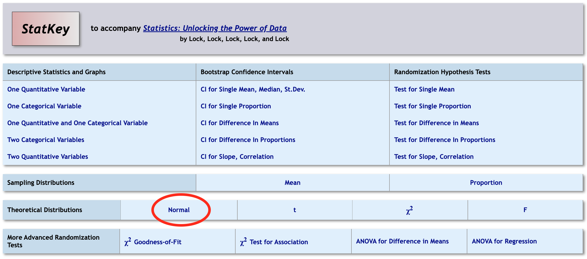
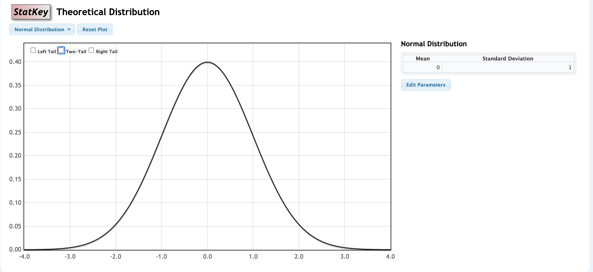

```{r setup, include=FALSE}
knitr::opts_chunk$set(echo = TRUE,message=FALSE,warning=FALSE)
```


```{r, echo=F,message=FALSE}
library(mosaic)
library(Lock5Data)
```

## Outline

* Normal distributions
* Standard normal distribution
* The Central Limit Theorem
* P-values from Normal Distributions
* P-values from Standard Normal Distributions


---

## Normal Distribution

* A **normal distribution**  has a *symmetric, single-peaked, and bell-shaped* density curve.

--

* Normal distributions are completely characterized by their mean $\mu$ and standard deviation $\sigma$

  + Centered at mean $\mu$
  
  + Inflection points at $\mu-\sigma$ and $\mu+\sigma$

--

Notation: $X$ has a Normal distribution with mean $\mu$ and standard deviation $\sigma$  

$$
X\sim N(\mu,\sigma)
$$

---

## Finding Areas under the Normal Curve  

Use StatKey to find areas and endpoints of intervals:


```{r, out.height ="400px",echo=FALSE,fig.align='center'}

```

---
## Finding Areas under the Normal Curve (cont'd)

Use StatKey to find areas and endpoints of intervals:


```{r, out.height ="400px",echo=FALSE,fig.align='center'}

```

---

## Standard Normal Distribution

The standard normal $(Z)$ distribution has

* Mean $\mu=0$

* Standard deviation $\sigma=1$

* Every normal distribution can be *standardized* to follow a *standard normal distribution*.

$$
Z=\frac{X-\mu}{\sigma}
$$

---
## Central Limit Theorem  

> For random samples with a *sufficiently large* sample size, the distribution of sample statistics for a mean or a proportion is approximately normal.

---

## Central Limit Theorem  

* The central limit theorem holds for **any** original distribution, although "sufficiently large sample size" varies.

    + The more skewed the original distribution is, the larger $n$ has to be for the CLT to work.

* For quantitative variables that are not very skewed, $n\ge 30$ is usually sufficient.

* For categorical variables, counts of at least 10 within each category are usually sufficient.

---

## Connecting the Normal Distribution to Randomization Distributions

If the randomization distribution is normal:  

> To calculate a $p$-value, we just need to find the area in the appropriate tail(s) beyond the observed statistic of the distribution   

$$
N(\text{null value}, \text{SE})
$$

---

## Standardized Test Statistic  

We often streamline the hypothesis test process by *standardization*:

> The standardized *test statistic* is the number of standard errors a test statistic is away from the hypothesized null value:

$$
z=\frac{\text{Sample statistic}-\text{Null parameter}}{\text{SE}}
$$

* Calculating the number of standard errors a statistic is from the null value allows us to assess *extremity* on a common scale.

---

## P-value Using the Standard Normal  


If a statistic is normally distributed under $H_0$, the **p-value** is the probability  a standard normal is at or beyond the standardized test statistic.

$$
z=\frac{\text{Sample statistic}-\text{Null parameter}}{\text{SE}}
$$

--
* One-tailed $p$-values  
    + $p=P(Z\ge z)$ or $p=P(Z\le z)$

* Two-tailed $p$-value  
    + Double the one-tailed value
  
where $P(Z\ge z)$ means the probability *to the right* of the observed test statistic $z$ under the standard normal density represented by $Z$.

---

## Summary

* If the distribution of a statistic is normal, the standardized test statistic is:


$$
z=\frac{\text{Sample statistic}-\text{Null parameter}}{\text{SE}}
$$

* Obtain the $p$-value by comparing $z$ to the **standard normal** $N(0,1)$ distribution.


