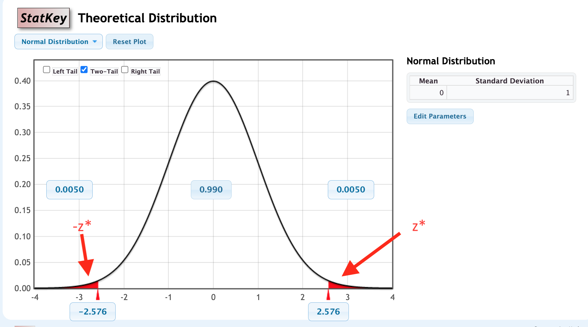

```{r setup, include=FALSE}
knitr::opts_chunk$set(echo = TRUE,message=FALSE,warning=FALSE)
```


```{r, echo=F,message=FALSE}
library(mosaic)
library(Lock5Data)
```


# Outline

* Confidence interval using a normal distribution  

---
### Example: Effect of prenatal sound Exposure on embronical survival in zebra finches

```{r, out.height ="400px",echo=FALSE,fig.align='center'}
knitr::include_graphics("https://www.science.org/cms/10.1126/science.ade5868/asset/44aae481-32a8-48f2-b44b-0eed90f7ead4/assets/images/large/science.ade5868-f2.jpg")
```


---
## Confidence Intervals Using Normal Distributions

> If a bootstrap distribution is bell-shaped, a P% confidence interval can be found as the interval containing the middle P% of the normal distribution with mean equal to the observed sample statistic and standard deviation equal to the standard error of the statistic:

$$
N(\mbox{sample statistic}, \mbox{SE})
$$


---

## Confidence Intervals Using the Standard Normal  

* If a statistic is normally distributed, we find a P% confidence interval for the parameter using

$$\text{statistic} \pm z^* \text{SE} $$  

where $z^*$ is the *critical value* with area P% between $-z^*$ and $z^*$ in the standard normal distribution.   


* Extends SE method to confidence levels beyond just 95%.

---
## Use StatKey to Find the Critical Value $z^*$

```{r, out.height ="400px",echo=FALSE,fig.align='center'}

```
---
## Chap 5 Summary: General Formulas

### Confidence interval

$$
\text{Sample Statistic}\pm z^* \text{SE}
$$

--

### Hypothesis test statistic

$$
\frac{\text{Sample statistic}-\text{Null parameter}}{\text{SE}}
$$

---

# Looking ahead

* For now, the $\text{SE}$ comes from **resampling** methods (randomization or bootstrap).

* Beginning next class, we use classical model-based **formulas** to compute $\text{SE}$.  
