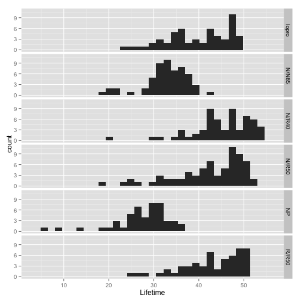

Mice Diet Restriction Analysis
========================================================


```r
# Load packages
require(ggplot2)
require(mosaic)
# Read data from class directory
mice <- read.csv("http://people.kzoo.edu/enordmoe/math261/data/mice_diet_restrict.csv")
```


### Get Summary Statistics


```r
favstats(Lifetime ~ Diet, data = mice)
```

```
##        min     Q1 median    Q3  max      mean        sd  n missing
## lopro 23.4 35.000  41.05 46.45 49.7 39.685714 6.9916945 56       0
## N/N85 17.9 31.400  33.10 36.40 42.3 32.691228 5.1252972 57       0
## N/R40 19.6 42.275  46.05 50.35 54.6 45.116667 6.7034058 60       0
## N/R50 18.6 37.950  43.90 48.20 51.9 42.297183 7.7681947 71       0
## NP     6.4 24.800  28.90 31.40 35.5 27.402041 6.1337010 49       0
## R/R50 24.2 39.150  43.95 48.35 50.7 42.885714 6.6831519 56       0
```


### Data plots

```r
# Data plots
qplot(Lifetime, data = mice, facets = Diet ~ .)
```

 

```r
qplot(Diet, Lifetime, data = mice, geom = "boxplot")
```

 

Plots and summary suggest differences in lifetime across diets.

### ANOVA procedures and output


```r
mod1 = lm(Lifetime ~ Diet, data = mice)
anova(mod1)
```

```
## Analysis of Variance Table
## 
## Response: Lifetime
##            Df  Sum Sq  Mean Sq F value     Pr(>F)    
## Diet        5 12733.9 2546.788 57.1043 < 2.22e-16 ***
## Residuals 343 15297.4   44.599                       
## ---
## Signif. codes:  0 '***' 0.001 '**' 0.01 '*' 0.05 '.' 0.1 ' ' 1
```

