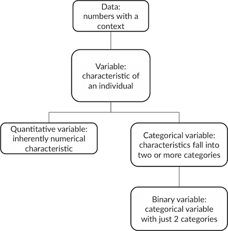
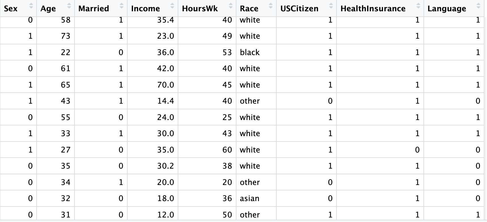
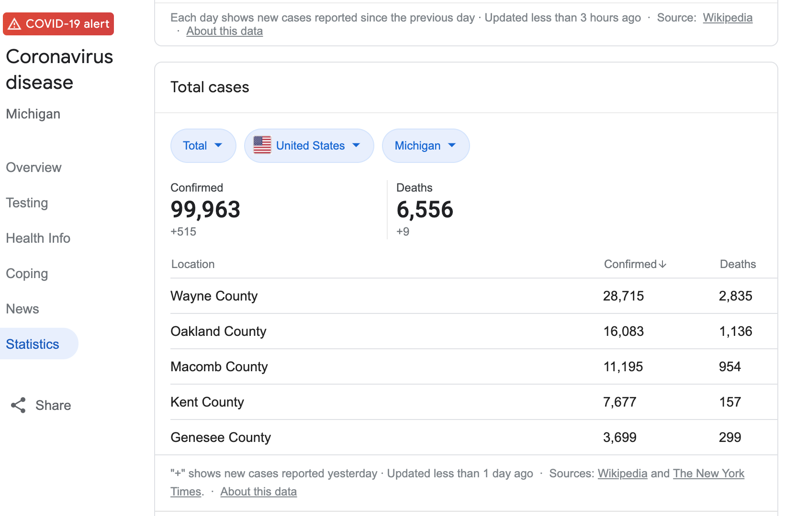
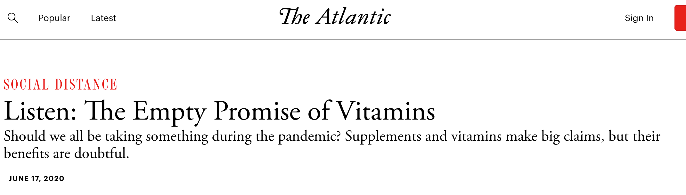

# Data

- Data are a set of measurements taken on a set of individual units

--

- Data is typically stored and presented in a *dataset*, comprised of variables measured on cases


???

These are presenter notes

---

# The Data Family Tree  



---

# Cautions 

* Race is a social construct    

--
$\Rightarrow$ How to measure the effects of systemic racism?  
$\Rightarrow$ How to study disease risk factors?  

--

* The [Gender Unicorn](https://www.transhealthsa.com/wp-content/uploads/2017/05/The-Gender-Unicorn.pdf)   

--
$\Rightarrow$ How to measure salary discrimination by sex/gender?  
$\Rightarrow$ Estimate incidence of cancer?  


---

# The American Community Survey

```{r, echo=FALSE, out.width="90%"}

```


- Rows are cases
- Columns are variables


---


# COVID-19 Data by County  

```{r, echo=FALSE}

```

---
 

# Flights Data

Source: [US Bureau of Transportation Statistics](https://www.transtats.bts.gov/ONTIME/Index.aspx)


```{r, echo=FALSE}
library(nycflights13)
knitr::kable(head(sample(flights[,c("flight","tailnum","origin","month","day","distance","air_time")],orig.ids=FALSE)))
```


--

Categorical - tailnum, origin, flight

--

Quantitative - distance, air_time, month, day  

--

**Careful**: Dates need to be handled with care and are not typical quantitative variables. Context is everything!  

???

More presenter notes here

---

# Flights Data Sets: Part 2  

```{r, echo=FALSE}
library(nycflights13)
knitr::kable(head(airports), digits = 2)
```


---


# Explanatory and Reponse Variables

If we are using one variable to help us understand or predict values of another variable, we call the former the **explanatory** variable and the 
latter the **response** variable.  
    
  
Examples:  
- Does meditation help reduce stress?  

```{r, echo=FALSE, out.height=200}
knitr::include_graphics("https://media.npr.org/assets/img/2014/01/07/mindfulness_wide-b20c3525971d5796eba9ad993463fffe8faf2bcb-s1500-c85.jpg")
```

Source: [NPR](https://www.npr.org/sections/health-shots/2014/01/07/260470831/mindfulness-meditation-can-help-relieve-anxiety-and-depression)

---

# Explanatory and Reponse Variables


- Do multivitamin supplements increase longevity?  





---
# Data is Everywhere!

Examples

* [US News and World Report National University Rankings]https://www.usnews.com/best-colleges/rankings/national-liberal-arts-colleges)
   + [No place like home](https://www.usnews.com/best-colleges/kalamazoo-college-2275)
   
--

* [US Government's Open Data](http://www.data.gov/)

--

* [CDC COVID Data Tracker](https://www.cdc.gov/covid-data-tracker/#cases/)

