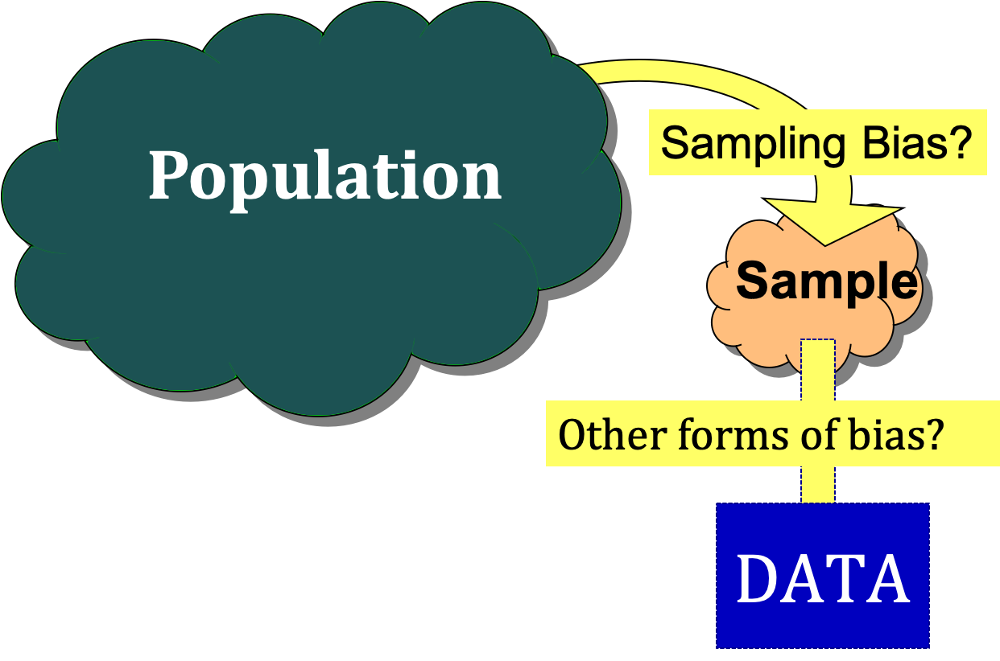

```{r setup, include=FALSE}
options(htmltools.dir.version = FALSE)
library(mosaic)
library(Lock5Data)
library(nycflights13)
```


```{r xaringan-themer, include=FALSE, warning=FALSE}
library(xaringanthemer)
style_duo_accent(
  primary_color = "#1381B0",
  secondary_color = "#FF961C",
  inverse_header_color = "#FFFFFF"
)
```


## Cooking up a Random Sample?

```{r, echo=FALSE}

```
---

# Sample versus Population  
  
* A **population** includes all individuals or objects of interest. 

--

* A **sample** is the set of cases for which we have data.  

--

* **Statistical inference** is the process of using a sample to learn about the population.  

---

# Sampling Bias  

**Sampling bias** occurs when the method of selecting a 
sample causes the sample to systematically differ from the population.  

---

# Simple Random Sample

When choosing a **simple random sample** of $n$ units, all groups of size $n$ in the population have the *same* chance of being selected for the sample.  

--

Use a simple random sample to avoid **sampling bias**.  

---

# Using R to Help Draw a Random Sample  

Generating random integers to select a random sample:  
```{r}
# Sample 5 students from a class of 28
sample(1:28,5)
```

---

# Using R to Sample from an R Data Frame

Randomly sample $n$ rows from a data set:  
```{r,eval=FALSE,message=FALSE}
library(mosaic)
library(Lock5Data)
# sample of size 3
sample(StudentSurvey, 3)
```

```{r,echo=FALSE,message=FALSE}
library(mosaic)
library(Lock5Data)
# sample of size 3
sample(StudentSurvey,3)[,1:4]
```

Note: Only the first 4 of 18 columns are shown due to space limitations.

---

# Saving a Sample as a New Data Set  

Randomly sample $n$ rows from a data set:
```{r,eval=FALSE,message=FALSE}
mysample <- sample(StudentSurvey, 3)
mysample
```

```{r,echo=FALSE,message=FALSE}
library(mosaic)
library(Lock5Data)
# sample of size 3
mysample <- sample(StudentSurvey, 3)[,1:4]
mysample
```

Note: Only the first 4 of 18 columns are shown due to space limitations.

---

# Other Kinds of Bias

In general, **bias** occurs when the method of collecting data causes the sample data to inaccurately reflect the population.  

--


* **Undercoverage** some groups of the population are omitted from the process of choosing the sample.  

--

* **Nonresponse bias** individuals can’t be contacted or refuse to participate.

--

* **Response bias** behavior of respondent or interviewer causes bias.  

--

* **Wording bias** wording of the question influences the response.  


---

# Data Collection and Bias  


