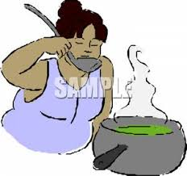
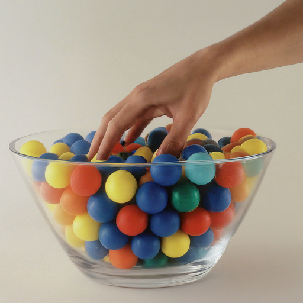
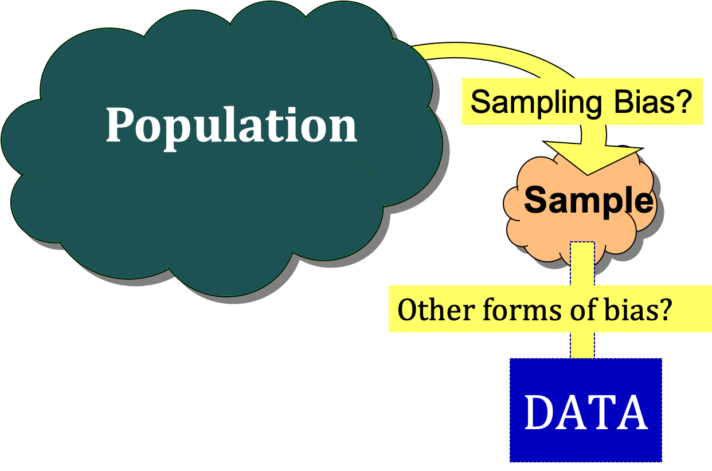

```{r setup, include=FALSE}
knitr::opts_chunk$set(message=FALSE,warning=FALSE)
```

```{r, echo=F,message=FALSE}
library(mosaic)
library(Lock5Data)
library(nycflights13)
```

## Cooking up a Random Sample?



## Warm-Up: Screen Time {.smaller}

In December 2024, Harmony Healthcare IT surveyed **1,001 U.S. adults**
about daily smartphone screen time. Average reported: **5 hrs 16
min/day**.

::: {.fragment}
**Turn and talk (60 sec):**   
* Who did this survey actually talk to?  
* Who is it trying to describe?  
* Are these the same group?  
:::

::: notes
Don't define "sample" or "population" yet. Let them wrestle with the
distinction using this concrete case first — the vocabulary lands
better once they've already felt the gap between "who we asked" and
"who we're claiming to describe."
:::

## Sample versus Population

::: incremental
-   A **population** includes all individuals or objects of interest.
-   A **sample** is the set of cases for which we have data.
-   **Statistical inference** is the process of using a sample to
    learn about the population.
:::

## Screen time revisited

::: {.fragment}
**Sample:** the 1,001 U.S. adults who reported their screen time.
:::

::: {.fragment}
**Population:** all U.S. adults.
:::

::: {.fragment}
**Quantitative or categorical?** Quantitative! Screen time is measured in hours.
:::

::: {.fragment}
* This **gap** between sample and population is the reason **how** you get
your sample matters.   
* What happens when the sampling goes wrong?  
:::

## Can We Trust This Poll? {.smaller}

Over 30,000 people participated in an online poll on **cnn.com** in
April 2012 asking *"Have you ever driven with a pet on your lap?"*
34% said yes.

::: {.fragment}
**Turn and talk (60 sec):** Can we conclude 34% of *all* drivers have
done this? Does it matter that 30,000 is a huge sample?
:::

::: notes
Push on the "30,000 is huge though" instinct here — this is the spot
to land that sample size and sampling bias are separate problems.
:::

## No! Why Not? {.smaller}

::: {.fragment}
* People who respond to an online poll are not a random
cross-section of drivers  
    — People with strong opinions are **more likely** to respond.  
:::

::: {.fragment}
* Increasing the sample size doesn't fix a *biased* collection method   
    — it just gives a more precise wrong answer.  
:::

::: {.fragment}
* Can we generalize to *all cnn.com visitors*?   
    — No, only to the ones who felt strongly enough to click.
:::

## Bias vs Sampling Bias

::: incremental
-   **Bias** exists when the method of collecting data causes the
    sample to inaccurately reflect the population.
-   **Sampling bias** occurs when *the method of selecting a sample*
    causes it to systematically differ from the population.
-   The CNN poll is an example of **sampling bias**: 
    * the *selection* process (self-selecting into an online poll) is the problem.
:::

## Fixing the Pet Poll

::: {.fragment}
**Turn and talk (60 sec):** How *would* you select a sample of
drivers whose results you could generalize to all drivers?
:::

::: {.fragment}
The answer  applies to nearly every data collection problem
we'll see this term.
:::

## Simple Random Sample

{.absolute bottom="50" right="0" height="220"}

When choosing a **simple random sample** of $n$ units, all groups of
size $n$ in the population have the *same* chance of being selected.

. . .

Use a simple random sample to avoid **sampling bias**.


##  Kinds of Bias {.smaller}

Recall: **Bias** occurs when the method of collecting the data causes the sample to
inaccurately reflect the population.

::: incremental
-   **Undercoverage** some groups are omitted from the selection
    process.
-   **Voluntary response bias** individuals self-select into the
    sample. *(The CNN pet poll.)*
-   **Nonresponse bias** selected individuals can't be reached or
    refuse to participate.
-   **Response bias** respondent or interviewer behavior distorts the
    answer.
-   **Wording bias** question phrasing influences the response.
:::

::: notes
Voluntary response bias is added here — HW2 Q9 asks students to name
exactly this concept for an opt-in email survey.
:::

## Bias vs Sampling Bias: Which Is Which? {.smaller}

Sampling bias is a *type* of bias, not a separate category — every
sampling bias is bias, not every bias is sampling bias.

| Type of Bias | Bias | Sampling Bias |
|---|:---:|:---:|
| Undercoverage | ✓ | ✓ |
| Voluntary response bias | ✓ | ✓ |
| Nonresponse bias | ✓ | |
| Response bias | ✓ | |
| Wording bias | ✓ | |

::: {.fragment}
**The difference**: did the problem happen *while choosing* who's in the
sample (undercoverage, voluntary response) — or *after* a sample was selected, once you tried to collect data from them?
:::

::: notes
You can draw a flawless simple random sample and still end up with
biased data if people don't respond, misreport, or the question is
worded to nudge answers. The selection method wasn't the problem —
the follow-through was. That's why nonresponse/response/wording sit
in the outer "bias" ring but not the "sampling bias" ring.
:::

## Poll: Which Kind of Bias? {.smaller}

You want to estimate how many hours a week students at your
university spend studying. For each method, is it **representative**,
or a specific kind of bias?

## (a) {.smaller}

Ask students leaving the dining hall around dinner time on a Tuesday.

::: {.fragment}
→ **Undercoverage** (misses students who eat elsewhere or at other
times)
:::

## (b) {.smaller}

Ask the students in Organic Chemistry.

::: {.fragment}
→ **Undercoverage** (skews toward pre-med / STEM-heavy study habits)
:::

## (c) {.smaller}

Ask all the students on the basketball team.

::: {.fragment}
→ **Undercoverage** (athletes' schedules may not resemble the
student body's)
:::

## (d) {.smaller}

Email all students, use whoever replies.

::: {.fragment}
→ **Nonresponse bias**
:::

## (e) {.smaller}

Ask friends on social media to re-share the survey link.

::: {.fragment}
→ **Voluntary response bias** (and undercoverage of anyone outside
that social network)
:::

## (f) {.smaller}

Ask a random sample of students.

::: {.fragment}
→ **Representative** — this is the one that works.
:::

::: notes
Quick show-of-hands per item works fine here — don't need a full
60-second turn-and-talk for each of the six; the pace should pick up
by (d) or (e) as the pattern becomes familiar.
:::

## One More Time, End to End: Employment Surveys {.smaller}

Employment statistics in the US come from two nationwide monthly
surveys: the **Current Population Survey (CPS)** samples about 60,000
US households and records each resident's employment status, job
type, and demographics. The **Current Employment Statistics (CES)**
survey samples 140,000 nonfarm businesses and government agencies and
records payroll jobs, pay rates, and related info for each firm.

## (a) Population Check {.smaller}

What is the population in the CPS survey? In the CES survey?

::: {.fragment}
**CPS:** all US residents. **CES:** all nonfarm US
businesses/agencies (jobs, not people).
:::

## (b) {.smaller}

Which survey would answer: *do larger companies tend to pay more?*

::: {.fragment}
→ **CES** (its cases are businesses, with pay data)
:::

## (c) {.smaller}

Which survey would answer: *what percent of Americans are
self-employed?*

::: {.fragment}
→ **CPS** (its cases are people, with employment status)
:::

## (d) {.smaller}

Which survey would answer: *are married men more or less likely to
be employed than single men?*

::: {.fragment}
→ **CPS** (needs individual demographics)
:::


## Data Collection and Bias

{alt="Diagram of Sampling from a Population"}

# R Procedures

## Using R to Draw a Random Sample {.smaller}

Generating random integers to select a random sample of 5 students
from a class of 30:

::: {.fragment}
**Before you look right:** guess — will two runs give you the same 5
numbers?
:::

::: columns
::: {.column width="50%"}
```{r}
#| eval: false
library(mosaic)
sample(1:30, 5)
```
:::

::: {.column width="50%"}
::: fragment
```{r}
#| echo: false
sample(1:30, 5)
```
:::
:::
:::

## Sampling from an R Data Frame {.smaller}

Randomly sample 3 rows from the **StudentSurvey** data set:

::: columns
::: {.column width="50%"}
```{r}
#| eval: false
library(mosaic)
library(Lock5Data)
# sample of size 3
sample(StudentSurvey, 3)
```
:::

::: {.column width="50%"}
::: fragment
::: {style="font-size: 0.4em"}
```{r}
#| echo: false
knitr::kable(sample(StudentSurvey, 3)) 
```
:::
:::
:::
:::

## Saving a Sample as a New Data Set {.smaller}

Randomly sample $3$ rows from **StudentSurvey** and save to a data
set called **mysample**:

::: columns
::: {.column width="55%"}
```{r}
#| eval: false
library(mosaic)
library(Lock5Data)
# sample of size 3
mysample <- sample(StudentSurvey, 3)
mysample
```
:::

::: {.column width="45%"}
::: fragment
::: {style="font-size: 0.4em"}
```{r}
#| echo: false
knitr::kable(sample(StudentSurvey, 3))
```
:::
:::
:::
:::
