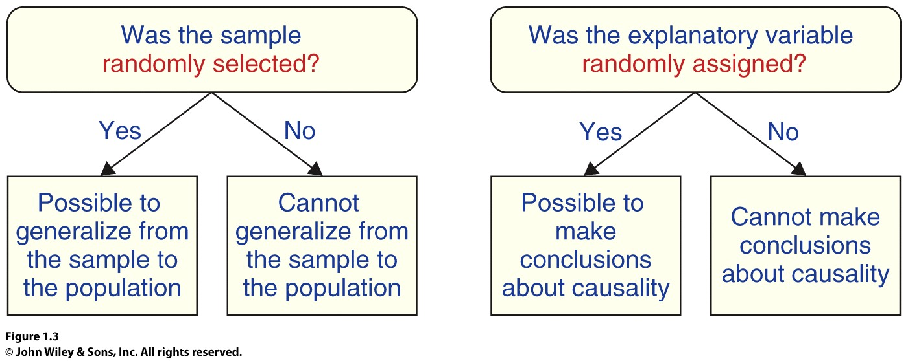

```{r setup, include=FALSE}
options(htmltools.dir.version = FALSE)
library(mosaic)
library(Lock5Data)
library(nycflights13)
```


```{r xaringan-themer, include=FALSE, warning=FALSE}
library(xaringanthemer)
style_duo_accent(
  primary_color = "#1381B0",
  secondary_color = "#FF961C",
  inverse_header_color = "#FFFFFF"
)
```


# A Quote

<blockquote>
The invalid assumption that correlation implies cause is probably among the two or three most serious and common errors of human reasoning.
.right[-- <cite>Stephen Jay Gould</cite>]
</blockquote>


???

Smoking and lung cancer?

---

# Association is not Causation!  

* Two variables are **associated** if values of one variable tend to be related to the values of the other variable.

--

* Two variables are **causally associated** if changing the value of one variable influences the value of the other variable.  

--

    + Temporal precedence  
    
--

    + Covariation (
    $A\rightarrow B$, 
    $\tilde A \rightarrow \tilde B$
    )  
    
--
    
    + No plausible alternative explanation  

---

# Life Expectancy and Internet

```{r, echo=FALSE, warning = FALSE}
gf_point(LifeExpectancy ~ Internet, data = SampCountries) %>%
  gf_labs(x="Percent with Internet Access")  
```

---

# Association or Causation?

Does the statement imply causation or just  association without causation?

1. If you study more, your grade will improve in this course.  

2. Want to lose weight?  Drink tea!  

3. People who chew sugar free gum have fewer cavities.  

---

# Confounding

**Definition:** A third variable that is associated with *both* the explanatory variable and the response variable is called a **confounding variable**

* Plausible explanation for an association between explanatory and response variables

* Prevents determining causation.

???

Sketch diagram of Explanatory, Response, and Confounding variable  

---

# Examples of Confounding Variables

Identify a possible confounding variable:  

* More ice cream sales have been linked to more deaths by drowning.  

* The total amount of beef consumed and the total amount of pork consumed worldwide are closely related over the past 100 years.  

* People who own a yacht are more likely to buy a sports car.  

* People with shorter hair tend to be taller.  

---

# Life Expectancy and Internet Revisited  

```{r, echo=FALSE, warning=FALSE, fig.height = 6}
gf_point(LifeExpectancy ~ Internet, color = ~ Developed, data = SampCountries) %>%
  gf_labs(x="Percent with Internet Access")  
```
???

Draw diagram in OneNote of confounding variable

---

# Two Primary Methods of Data Collection


*  **Observational study** observing individuals and measuring variables of interest without attempting to influence responses.  
    - Purpose: descriptive, study of associations  

--

*  **Experiment** a study in which the researcher actively controls one or more of the explanatory variables.  
    - Purpose: investigate cause-and-effect relationships

---


# Randomization

Eliminate confounding factors by **randomization**

* Randomly assign values of the explanatory variable in an experiment.

---

# Randomized Experiment

* The different levels of the explanatory variable are known as **treatments**

* Randomly divide the units into groups.

    + Randomly "shuffle" the experimental units before assigning to groups.

* Randomly assign a different treatment to each group.

* If the treatments are randomly assigned, the **treatment groups** should be similar.


---

# Does a Small Amount of Exercise Raise Pulse Rates?

**Question:** Is just 10 or 20 seconds of exercise enough to increase pulse rate?  

* **Treatment groups**: (1) seated, (2) exercise 10 seconds, (3) exercise 20 seconds

* Randomly divide the class into the three groups

* Obtain baseline pulse rate (beats per 30 seconds)

* Administer the treatment
    + Run in place for 10 or 20 seconds.

* Measure pulse after treatment (rate in beats per 30 seconds)  
    + Compute response=change in pulse (after-before)
 
---

# Using R to Randomly Assign Treatments

```{r,include=FALSE}
myclass <- read.csv("http://people.kzoo.edu/enordmoe/math260/data/myclasslist.csv")
```

* Randomly assign students in **myclass**   

```{r, message=FALSE}
head(myclass)
```

---

# Using R to Randomly Assign Treatments (cont'd)  

* Use  the `shuffle()` function from mosaic to randomly shuffle rows  

```{r}
library(mosaic)
newlist <- shuffle(myclass)
head(newlist)
```


---

# Using R to Randomly Assign Treatments (cont'd)  

* Assign the first third to group 1, second third to group 2,...  
```{r,eval=F}
# Group 1
newlist[1:15,]
# Group 2
newlist[16:30,]
# Group 3
newlist[31:45,]
```

---

# Principles of Statistical Design of Experiments

1. Random allocation into experimental groups

2. Control the effect of outside variables
    + A **control group** is a group of subjects from which the treatment of interest is withheld.
   
3.  Replication on many subjects to reduce chance variation


---

# More Control Mechanisms

* **Placebo** a fake  treatment that simulates the idea of a treatment of interest

    + Placebo effect: people experience the effect they think they should be experiencing, even if they aren’t actually receiving the treatment 

* **Double-blind study** neither the participant nor the evaluator knows the participant's treatment 

???
Use knee surgery study to motivate additional control mechanisms

---

# Two Types of Randomized Experiments

1. In a **randomized comparative experiment**, we randomly assign cases to
different treatment groups and then compare results on the response
variable(s).

2. In a **matched pairs experiment**, each case gets both treatments in
random order (or cases get paired up in some other obvious way), and
we examine individual differences in the response variable between
the two treatments.

---

# Matched Pairs

**Matched pairs** designs have at least two different forms: 

1.  Each participant gets both treatments in a random order OR...

--

2.  Participants are paired based on some identifiable characteristic and a randomly selected member of each pair gets each treatment.

???

Migraine study: 

trigger point injections vs botox injections (and a placebo)

Design 1: each person gets both; Design 2: paired based on severity and frequency of headache and each given 1


---

# Randomization and Scope of Inference

```{r, out.width = "700px",echo=FALSE}

```


---
class:  center, middle

# For Class 

---

# Principles of Experimental Design

* Control

--

* Randomization

--

* Replication

---

# Example: The Power of Kawaii  

Questions about the design:

* What are the cases?

* What are the variables?
    + Explanatory
    + Response

* What are the treatment groups?

* How did researchers control for the effect of differing abilities of participants?

* What can be concluded?

???

What was changed in Experiment 2? Why food?


