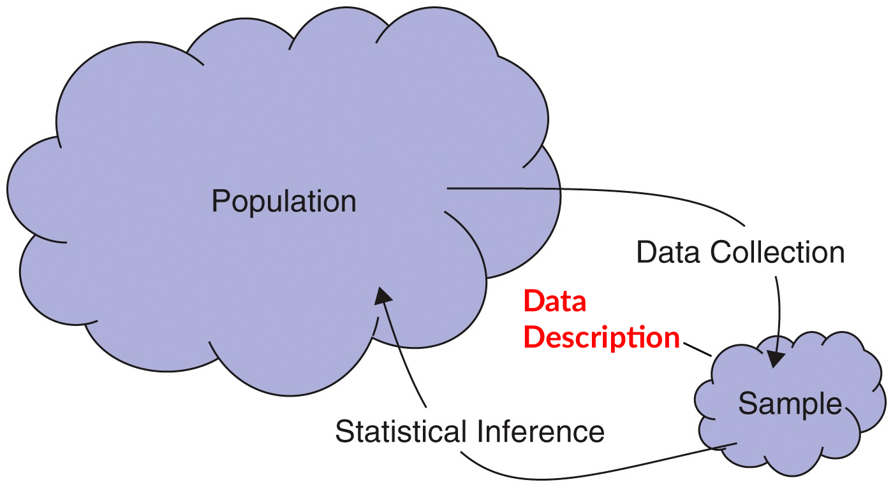
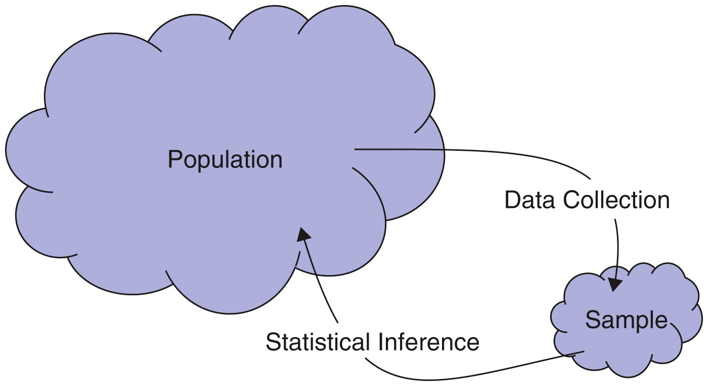

```{r setup, include=FALSE}
knitr::opts_chunk$set(message=FALSE,warning=FALSE)
library(mosaic)
library(Lock5Data)
```

## Outline

- **The Big Picture**: The role of data description in statistics.
- **Descriptive Statistics**: Summarizing and visualizing categorical variables.
- **Numerical Summaries**: Frequency tables and proportions.
- **Visual Summaries**: Bar charts, proportion charts, and pie charts.
- **Two-Way Tables**: Exploring relationships between two categorical variables.
- **Graphical Comparisons**: Stacked and side-by-side bar charts.


## The Big Picture

{.absolute top="100" left="0"}

::: {.fragment .fade-out}
{.absolute top="100" left="0"}
:::

::: aside
Source: Lock5 text image
:::

## Descriptive Statistics

-   To make sense of data, we need to **summarize and visualize** it.

-   **Descriptive statistics:** summarizing and visualizing variables and relationships between variables.

-   Different methods are used for [categorical]{style="color:red;"} and [quantitative]{style="color:red;"} variables.

# Numerical and Visual Descriptions for Categorical Variables

## Summarizing Single Categorical Variables {.smaller}

### Summary statistics :computer:

-   **Frequency table** table showing number of cases in each category

-   **Proportion** number in category/total sample size

-   **Relative frequency table** table showing proportion of cases in each category

### Visualizations :bar_chart:

-   **Bar chart** height of the bar shows the number (or proportion or percent) of cases in each category

-   **Pie chart** relative area represents proportion in each category (less preferred)

## Frequency Table of Counts

```{r}
tally(~LarkOwl, data = SleepStudy)
```

## Relative Frequency Table

```{r}
tally(~LarkOwl, format = "proportion",
      margins = TRUE, data = SleepStudy)
```

## Bar Chart of Single Variable

```{r}
gf_bar(~LarkOwl, data = SleepStudy)
```

## Bar Chart of Single Variable: with colors

```{r}
gf_bar(~LarkOwl, fill = ~ LarkOwl, data = SleepStudy,
       show.legend = FALSE)
```

## Proportion Bar Charts 

-   `gf_props()` plots **proportions** directly — no need for `position = "fill"`.

```{r}
gf_props(~LarkOwl, data = SleepStudy)
```

-   Same idea as `gf_bar()`, but the y-axis is already a proportion.

## Summarizing Two Categorical Variables: Two-Way Tables

Frequency table used to look at the relationship between two categorical variables

-   Variable 1 categories: rows
-   Variable 2 categories: columns
-   Cell counts (frequencies): number of cases in corresponding row and column categories

## Two-Way Tables Example {.smaller}

Cross classify two categorical variables to investigate their relationship:

```{r}
tally(~EarlyClass + LarkOwl, margins = TRUE,
      data=SleepStudy)
```

<small>Note: For *EarlyClass*, 0 = "No" and 1 = "Yes"</small>
 
::: {.fragment}
#### Questions  
::: {.incremental}
-   What proportion of students with early classes are Larks?  
-   What proportion of students without early classes are Larks?  
-   What proportion of Owls have early classes?  
:::
:::
## Two-Way Tables Example with Proportions {.smaller}

```{r}
tally(~EarlyClass + LarkOwl, margins = TRUE,
      format = "proportion", data = SleepStudy)
```

<br>

**Note:** Proportions here are based on total sample.  

## Two-Way Tables Example with Conditional Proportions {.smaller}

```{r}
tally(EarlyClass ~ LarkOwl, margins = TRUE,
      format = "proportion", data = SleepStudy)
```

<div style="height:0.5em;"></div>

-   Read `A ~ B` as "A, broken down by B"
    - The proportion of *EarlyClass* within **each level of** *LarkOwl* (columns sum to 1).   
-   Conditional proportions are useful for comparing groups
    - ⚠️  Be sure you know which direction you're conditioning in.


## Stacked Bar Charts for Two Variables {.smaller}

-   **Stacked bar chart** graphical display of a two-way table of counts

    -   Note use of `factor()` to treat *EarlyClass* as categorical.

```{r}
gf_bar(~ LarkOwl, fill = ~factor(EarlyClass), data = SleepStudy)
```

## Segmented Bar Chart: Comparing Proportions {.smaller}

```{r}
gf_props(~LarkOwl, fill = ~factor(EarlyClass), data = SleepStudy, 
          position = "fill")
```

-   `position = "fill"` makes every bar the same height, so you compare **proportions** rather than counts.


## Side-by-Side Bar Charts

-   **Side-by-side** height of each bar is the number of the corresponding cell in the two-way table

```{r, fig.height=4}
gf_bar(~LarkOwl, fill = ~factor(EarlyClass), 
       data = SleepStudy, position = "dodge")
```

## Aesthetic Mappings {.smaller}

-   We control the appearance of graphs in R using *aesthetics*, things we can see

-   Examples of aesthetics include:

    -   position (i.e., on the x and y axes)\
    -   color ("outside" color)\
    -   fill ("inside" color)
    -   shape (of points)\
    -   linetype\
    -   size

-   Each type of graph accepts only a subset of possible aesthetics.

-   Using commands to create graphs makes it easy to reproduce or update them later.

## Choosing the Right Table or Chart {.smaller}

```{=html}
<style>
.chart-table table { table-layout: fixed; width: 100%; }
.chart-table code { white-space: nowrap; font-size: 0.62em; }
.chart-table th:first-child, .chart-table td:first-child { width: 26%; }
.chart-table th:not(:first-child), .chart-table td:not(:first-child) { width: 37%; }
</style>
```

::: {.chart-table}
| Goal | Table (`tally()`) | Chart (`gf_`) |
|---|---|---|
| One variable, counts | `tally(~ A)` | `gf_bar(~ A)` |
| One variable, proportions | `tally(~ A, format = "proportion")` | `gf_props(~ A)` |
| Two variables, joint counts | `tally(~ A + B)` | `gf_bar(~ A, fill = ~ B)` |
| Two variables, conditional proportions | `tally(B ~ A, format = "proportion")` | `gf_props(~ A, fill = ~ B, position = "fill")` |
| Two variables, side-by-side comparison | — | `gf_props(~ A, fill = ~ B, position = "dodge")` |
:::


## Summary {.smaller}

-   Descriptive statistics summarize and visualize categorical variables in frequency tables, proportions, and relative frequency tables.
-   Bar charts (`gf_bar()`) visualize counts; `gf_props()` visualizes proportions directly.
-   Two-way tables show the relationship between two categorical variables using frequency and proportion tables.
-   Conditional proportions offer detailed comparisons by showing the proportion of one category within each level of another category.
-   Segmented, stacked, and side-by-side bar charts offer insightful comparisons of categorical data across multiple variables.
