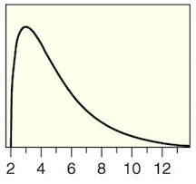
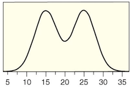

```{r setup, include=FALSE}
options(htmltools.dir.version = FALSE)
library(mosaic)
library(Lock5Data)
```


```{r xaringan-themer, include=FALSE, warning=FALSE}
library(xaringanthemer)
style_duo_accent(
  primary_color = "#1381B0",
  secondary_color = "#FF961C",
  inverse_header_color = "#FFFFFF"
)
```


# Dotplot

In a **dotplot**, each case of a quantitative variable is represented by a dot over the corresponding value.  

--

* Dots are stacked to show repeated values  

--

* Especially useful for relatively **small** datasets with repeated cases having the same value.  

---

# Dotplot: Example

* Example dotplot for **CaffeineTaps** data set $(n=20)$:   

```{r,fig.height=3, message = FALSE}
gf_dotplot(~Taps, data = CaffeineTaps)
```

---

# Histogram

* The height of each bar corresponds to the number of cases in the corresponding range of a quantitative variable.

* Especially useful for relatively **large** datasets.  


```{r, fig.height=4}
gf_histogram(~WeekdaySleep, data = SleepStudy)
```

---

# Histogram vs Bar Chart

### Bar chart

* Use for categorical data
* $x$-axis has no numerical scale
* The number of bars is the number of categories

--

### Histogram

* Use for quantitative data
* $x$-axis is numeric (drawn to scale)
* The number of bars is set by judgement
* Appearance differs depending on interval width

---

# Shapes of Distributions

.pull-left[
### Skewed Left

]

.pull-right[
### Skewed Right

]

---


# Shapes of Distributions

.pull-left[
### Symmetric <br>bell-shaped

]

.pull-right[
### Symmetric but not <br> bell-shaped

]

---

# Outlier

An **outlier** is an observed value that is notably distinct from the other values in a dataset. Usually, an outlier is much larger or much smaller than the rest of the data values.  

* A rule of thumb for identifying possible outliers is given in Section 2.4.  

---


# Mean

The **mean** of the data values for a single quantitative variable is given by  

$$
\text{Mean}=\frac{x_1+x_2+\cdots+x_n}{n}
$$

* The mean of a sample is $\bar x$.  

* The mean of a population is denoted $\mu$.  

* The mean is the "balancing point" of a dotplot or histogram.   


---

# R Examples: Mean

* Mean of a single numerical variable:  

```{r}
mean(~WeekdaySleep, data = SleepStudy)
```

* Mean of a single numerical variable for each category of a categorical variable:  

```{r}
mean(WeekdaySleep ~ EarlyClass, data = SleepStudy)
```

---

# Median

The **median**, $m$, of a quantitative variable is  

* the middle entry if there are an *odd* number of data values or  

* the average of the two middle values if there are an *even* number of data values.  

* The median divides the area of a histogram in half.  

* Useful applet for exploring properties of mean and median
   - [Mean and median applet](http://digitalfirst.bfwpub.com/stats_applet/stats_applet_6_meanmed.html)

---

# R Examples: Median

* Median of a single numerical variable:  

```{r}
median(~WeekdaySleep, data = SleepStudy)
```

* Median of a single numerical variable for each category of a categorical variable:  

```{r}
median(WeekdaySleep ~ EarlyClass, data = SleepStudy)
```


---

# Resistance

A statistic is **resistant** if it is relatively unaffected by extreme values.  
* The median is resistant but the mean is not.  
* When a distribution is skewed, the mean is pulled in the direction of the skewness.  
    + Right skewness $\Rightarrow$ mean > median  
    + Left skewness  $\Rightarrow$ mean < median  
```{r, out.height ="200px",echo=FALSE,fig.align='center'}
knitr::include_graphics("figs/mean_median_plot.jpg")
```

---

# Summary

* Visualizing one quantitative variable:  
    + Dotplot  
    + Histogram  
    
--
    
* Shape:  
    + Symmetric  
    + Skewed  
    
--
    
* Measures of center  
    + Mean (not resistant to outliers)  
    + Median (resistant to outliers)  


