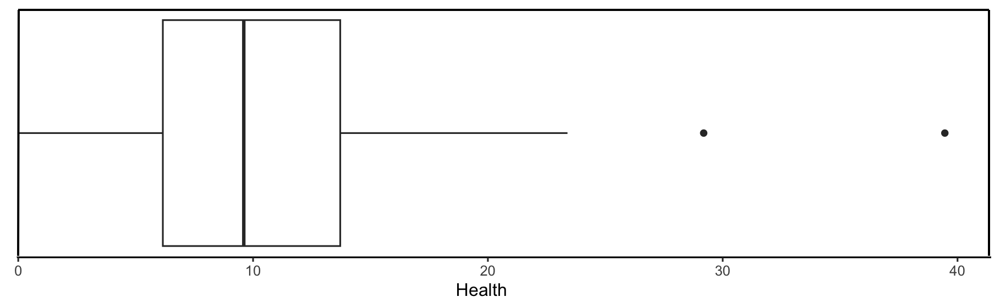
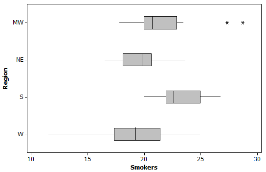
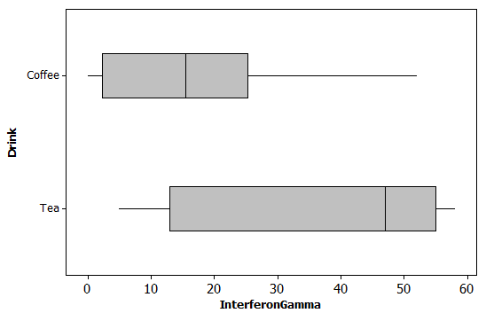

```{r setup, include=FALSE}
knitr::opts_chunk$set(message=FALSE,warning=FALSE)
```

```{r, echo=F,message=FALSE}
library(mosaic)
library(Lock5Data)
```

## Agenda {.smaller}

- **Introduction to Boxplots**  
  - Definition and components of a boxplot
  - Constructing and reading boxplots

- **Analyzing Quantitative and Categorical Relationships**  
  - Comparing distributions of a quantitative variable across groups
  - Using side-by-side boxplots for visual comparison

- **Advanced Visualization**  
  - Faceted plots: dotplots and histograms for group comparisons
  - Overlaying data by jittering for more detail

## Warm-Up: Picturing Five Numbers {.smaller}

In 2.3 we summarized a quantitative variable with the
**five-number summary**: min, $Q_1$, median, $Q_3$, max.

::: {.fragment}
**Turn and talk (60 sec):**  
1. If you had only those five numbers, how would you *draw* them on a
number line?  
2. What would your picture show well? What would it hide?
:::

::: notes
Let them invent the boxplot before seeing it. Most pairs land on
"mark the five points and connect them" — push on what the middle
50% looks like. Save question 2 for the end of the lecture too: the
answer ("hides shape details like gaps or two peaks") motivates the
faceted dotplots and histograms.
:::

## Boxplot

-   A **boxplot** is

    -   A visual depiction of the 5-number summary.

    -   Especially useful for a rough comparison of the center and spread of a variable across several sub-groups.

## Constructing a Boxplot {.smaller}

1)  Draw a numerical scale appropriate for the data.

2)  Draw a box stretching from $Q_1$ to $Q_3$ representing the middle 50% of the data.

3)  Divide the box with a line at the median.

4)  Draw a line (whisker) from each quartile to the most extreme data value that is **not an outlier**.

5)  Identify each outlier individually by plotting with a symbol such as an asterisk or dot.

**Note:** Use side-by-side boxes to compare sub-groups.

## Outliers

-   Often best identified using judgement by inspection of a visual data display.

-   **Rule of Thumb** suspected outliers are data values more than 1.5 IQRs beyond the quartiles

-   A data value is a **suspected outlier** if it is

    -   Smaller than the **Lower Fence**= $Q_1$ - 1.5 (IQR)

    -   Greater than the **Upper Fence**= $Q_3$ + 1.5 (IQR)

## Example 1: Health Spending Around the World {.smaller}

Health expenditures as a percentage of government expenditures for
188 countries (**AllCountries3e**).

{height="170"}

::: {.fragment}
**(a)** Are there any outliers? If so, approximately what are their values?
:::

::: {.fragment}
**(b)** Estimate the range and the IQR.
:::

::: {.fragment}
**(c)** Estimate the median.
:::

::: {.fragment}
**(d)** Symmetric, skewed left, skewed right, or none of these?
:::

::: {.fragment}
**(e)** Do you expect the mean to be greater than or less than the median?
:::

::: notes
Pairs work all five, then share. Approximate answers:
(a) Yes — two, about 29 and about 39.5.
(b) Range ≈ 39.5 − 0 ≈ 39.5. IQR ≈ 13.7 − 6.1 ≈ 7.6.
(c) Median ≈ 9.7.
(d) Skewed right (long right whisker, high outliers).
(e) Mean > median — the long right tail pulls the mean up.
Follow-up if time: check (a) with the fence. Upper fence ≈ 13.7 +
1.5(7.6) ≈ 25; the whisker stops at ≈ 23.4, and 29 and 39.5 are beyond
the fence. Lower fence is negative, so no low outliers possible.
:::

# Comparing Groups {background-color="#FAD9C7"}

## Boxplot example comparing groups: Vertical

```{r}
gf_boxplot(Quetelet ~ Smoke, data = NutritionStudy)
```

## Boxplot example comparing groups: Horizontal

Just interchange the $X$ and $Y$ variables:

```{r}
gf_boxplot(Smoke ~ Quetelet, data = NutritionStudy)
```

::: {.fragment}
**Turn and talk (30 sec):** In one sentence, how does BMI compare
for smokers and nonsmokers?
:::

::: notes
Nudge them to compare *center* (medians) and *spread* (box widths),
and to mention outliers — that's the template for every comparison
that follows.
:::

## Example 2: Smokers by Region {.smaller}

Percent of adult residents who smoke in each state, by region of the
U.S.

::: columns
::: {.column width="50%"}

:::

::: {.column width="50%"}
::: {.fragment}
**(a)** In general, which region seems to have the highest percent of
smokers?
:::

::: {.fragment}
**(b)** In which region is the state with the highest percent of
smokers?
:::

::: {.fragment}
**(c)** Which region has the greatest variability?
:::

::: {.fragment}
**(d)** Do any of the regions have outliers? If so, which ones?
:::
:::
:::

::: notes
(a) South — highest median and the whole box sits to the right.
(b) Midwest — the outlier near 28.7. Good contrast with (a): "highest
in general" is about center; "highest single state" is about an
extreme value. Worth a pause.
(c) West — largest range (≈ 11.5 to 25) and largest IQR (≈ 4).
(d) Midwest, two high outliers (≈ 27.3 and ≈ 28.7).
:::

#  {background-color="#FAD9C7"}

::: {#title-slide .center}
[Your turn: Investigate Quetelet (BMI) by Prior Smoking Status (PriorSmoke)]{style="font-size: 1.5em; font-weight: bold;"}
:::

## Your Turn: BMI by Prior Smoking {.smaller}

With a partner, make a boxplot of `Quetelet` by `PriorSmoke`
(1 = never, 2 = former, 3 = current) in **NutritionStudy**.

::: {.fragment}
**Compare the groups:**  
1. Which group has the highest median BMI?  
2. Which group is most spread out?  
3. Any outliers? In which group(s)?  
:::

::: {.fragment}
**Did anything look strange about your plot?**
:::

::: notes
The "strange" prompt is the setup for the next slide: PriorSmoke is
stored as numbers, so `gf_boxplot(Quetelet ~ PriorSmoke, ...)` treats
it as quantitative and draws one box (or complains) instead of three.
Let a pair who hit this explain it before revealing factor().
:::

## Advanced Boxplot for RStudio Masters {.smaller}

```{r,fig.height=3}
gf_boxplot(factor(PriorSmoke) ~ Quetelet, data = NutritionStudy,
           outlier.shape = NA, ylab = "Prior Smoking Status") |>
  gf_jitter(height = .1, alpha = .4) 
```

-   Use `factor(PriorSmoke)` to tell R to treat *PriorSmoke* numbers (1, 2, 3) as categories.
-   Overlays points using `jitter` on top of boxes to show more detail
-   `alpha` used to make points transparent (between 0 and 1)
-   Adds y label using `ylab`

::: notes
Ask: why set `outlier.shape = NA` here? (Otherwise outliers get drawn
twice — once as a boxplot dot and once as a jittered point.)
:::

# Faceted plots for more detailed comparisons {background-color="#FAD9C7"}

## Side-by-side Dotplots

-   For small samples, we can get a detailed plot of hours exercised for for each `Year` (1 = First Years, ...)
-   Use the vertical bar (`|`) to "condition" on the group variable.
-   `Year ~ .` specifies `Year` as the explanatory variable.

```{r}
#| output-location: slide
gf_dotplot(~Exercise | Year ~ ., data = ExerciseHours, dotsize = 0.5)
```

::: aside
Note: We actually could specify two variables such as `Year ~ Sex` to get a matrix of plots. Here, the `.` serves as a placeholder.
:::

## Faceted Histograms

For larger samples, we get side by side histograms of BMI (`Quetelet`) for each level of the `PriorSmoke` variable.

```{r}
#| output-location: slide
gf_histogram(~Quetelet | PriorSmoke ~ ., data = NutritionStudy)
```

## Boxplot or Histogram? {.smaller}

::: {.fragment}
**Turn and talk (60 sec):** Look back at your warm-up answer —
what does a boxplot *hide*?  
What can you see in the faceted histograms that the boxplots
couldn't show you?
:::

::: notes
Target ideas: boxplots hide the shape inside the box and whiskers —
gaps, clusters, two peaks — and don't show sample size. Histograms
show shape but make quick comparison of centers harder. Use boxplots
for the overview, faceted plots for the detail.
:::

## Comparing Numerical Statistics

Use `favstats()` to compare numerical statistics for a *quantitative variable* across *categories* of a categorical variable:

```{r}
favstats(Calories ~ PriorSmoke, data = NutritionStudy)
```

## Investigating Quantitative and Categorical Relationships  {.smaller}

-   Compare the distribution of a quantitative variable across groups determined by the categorical variable(s).

    -   Use side-by-side boxplots for an overview.

    -   Use comparative histograms or dotplots to see more detail.

-   Any of the statistics we use for a quantitative variable can be looked at separately for each level of a categorical variable.

    -   Often interested in the **difference in means** $=\bar x_1- \bar x_2$

## Self-Quiz: Tea vs. Coffee (Part 1) {.smaller}

Participants were **randomized** to drink tea or coffee every day for
two weeks. Blood samples were then exposed to an antigen and an immune
response was measured (higher = stronger).

::: columns
::: {.column width="50%"}

:::

::: {.column width="50%"}
::: {.fragment}
**(a)** Does there appear to be a relationship between the drink (tea
or coffee) and immune response?
:::

::: {.fragment}
**(b)** Which group appears to have the stronger immune response?
:::

::: {.fragment}
**(c)** Are there outliers in either group? If so, which one(s)?
:::
:::
:::

::: notes
(a) Yes — the tea box sits well to the right of the coffee box.
(b) Tea (median ≈ 47 vs ≈ 15.5).
(c) No — no points plotted beyond the whiskers in either group.
:::

## Self-Quiz: Tea vs. Coffee (Part 2) {.smaller}

```
   Drink min   Q1 median   Q3 max     mean       sd  n missing
1 Coffee   0  5.0   15.5 21.0  52 17.70000 16.69364 10       0
2    Tea   5 15.5   47.0 53.5  58 34.81818 21.08468 11       0
```

::: {.fragment}
**(d)** Give notation for and find the difference in means.
:::

::: {.fragment}
**(e)** Are these results evidence that tea *causes* an increase in
this aspect of the immune response? Why or why not?
:::

::: notes
(d) x̄_T − x̄_C = 34.82 − 17.70 ≈ 17.12 (either order is fine if they
say which is which).
(e) Randomization is what makes a causal conclusion possible — this is
an experiment, not an observational study. The open question is whether
a difference this big could just be chance with samples of 10 and 11;
that's what Chapter 4 will let us answer. Also worth noting: the
favstats Q1 for coffee (5.0) doesn't match the plot's box edge (≈ 2) —
different software, different quartile methods.
:::

## Wrapping Up: Boxplots & Group Comparisons {.smaller}

::: incremental
-   A **boxplot** pictures the five-number summary; values beyond the
    fences $Q_1 - 1.5(\text{IQR})$ and $Q_3 + 1.5(\text{IQR})$ are
    plotted individually as suspected outliers.
-   **Side-by-side boxplots** give a quick comparison of center,
    spread, and outliers across groups.
-   Boxplots **hide shape details** $\Rightarrow$ use faceted dotplots or
    histograms (`|`) when you need to see more.
-   `favstats(y ~ group)` gives summary statistics for each group; the
    **difference in means** $\bar x_1 - \bar x_2$ summarizes the
    relationship.
-   A difference between groups shows an **association**; we need a randomized experiment to claim cause-and-effect.
:::

More [details and examples](https://heroic-horse-92e142.netlify.app/describing_quantitative_variables_m260) in the R Resources on Moodle
