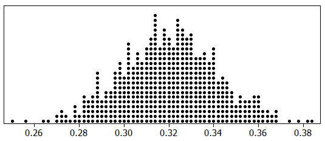
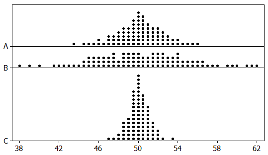

```{r, echo=F,message=FALSE}
library(mosaic)
library(Lock5Data)
```

## Outline

-   Statistical inference

-   Statistics versus parameters

-   Sampling distributions

-   Variability of the statistic: standard error

-   Importance of sample size

-   Importance of random sampling

## Warm-Up: Do It Again? {.smaller}

In October 2025, Pew Research Center surveyed **5,111 U.S. adults**.
**22%** said they get health information from AI chatbots at least
sometimes.

::: {.fragment}
**Turn and talk (60 sec):**  
1. If Pew repeated the survey the next week with a *new* random sample of
5,111 adults, would they get exactly 22% again?  
2. Would they get something *close* to 22%? How close?  
3. Is 22% the answer for *all* U.S. adults?
:::

::: notes
Don't introduce "parameter," "statistic," or "sampling distribution"
yet. Students almost always say "not exactly, but close" — that
intuition is the whole section. Question 2 ("how close?") is what
standard error will answer by the end of class.
:::

## Statistical Inference

**Statistical inference** is the process of drawing conclusions about the entire *population* based on information in a *sample*.

A **parameter** is a number that describes some aspect of a **population.**

A **statistic** is a number that is computed from data in a **sample.**

## Parameter vs Statistic

| Measure     | **Parameter** | **Statistic** |
|-------------|:-------------:|:-------------:|
| Mean        |     $\mu$     |   $\bar x$    |
| Proportion  |      $p$      |   $\hat p$    |
| Std Dev     |   $\sigma$    |      $s$      |
| Correlation |    $\rho$     |      $r$      |

-   We use a *statistic* from a *sample* as a **point estimate** of the corresponding *population parameter*.

## Example 1: Health Information from AI Chatbots {.smaller}

Back to Pew: Of 5,111 U.S. adults surveyed in October 2025, 22% reported
getting health information from AI chatbots at least sometimes.

**(a)** Find the relevant proportion and give the correct notation with it.

::: {.ws}
:::

**(b)** Is your answer to part (a) a parameter or a statistic?

::: {.ws}
:::

**(c)** Give notation for and define the population parameter that we
estimate using the result of part (a).

::: {.ws-l}
:::

::: notes
(a) p̂ = 0.22.
(b) Statistic — computed from the sample of 5,111.
(c) p = the proportion of *all* U.S. adults who get health information
from AI chatbots at least sometimes.
Push for a full definition in (c): "the proportion" alone isn't enough
— proportion *of whom*, doing *what*.
:::

## Example 2: Books Read in a Year {.smaller}

A survey of 2,986 Americans ages 16 and older found that 80% of them
read at least one book in the last year. Of these book readers, the
**mean** number of books read in the last year is **17**, while the
**median** is **8**.

**(a)** How many "book readers" (read at least one book in the past
year) were included in the sample?

::: {.ws-l .ed contenteditable="true"}
:::

**(b)** Why might the mean and median be so different? What is the
likely shape of the distribution of books read by book readers?

::: {.ws-l .ed contenteditable="true"}
:::

::: notes
(a) 0.80 × 2,986 ≈ 2,389.
(b) Skewed right — a few heavy readers (50, 100+ books) pull the mean
up; the median is resistant. Good callback to Chapter 2.
:::

## Example 2 (continued) {.smaller}

Recall: among the book readers in the sample, the **mean** number of
books read in the last year is **17** and the **median** is **8**.

**(c)** Give the correct notation for the value 17. Is it a parameter
or a statistic?

::: {.ws-l .ed contenteditable="true"}
:::

**(d)** Give notation for and define the population parameter that we
estimate using the result of part (c).

::: {.ws-l .ed contenteditable="true"}
:::

::: notes
(c) x̄ = 17, a statistic.
(d) μ = the mean number of books read in the last year by *all
American book readers* ages 16+. Common slip: defining it for all
Americans — the 17 was computed only for book readers, so that's the
population it estimates.
:::

## Self-Quiz: Parameter or Statistic? {.smaller}

For each, state whether the quantity is a **parameter** or a
**statistic**, and give the correct notation.

**(a)** The proportion of all residents in a county who smoke.

::: {.ws}
:::

**(b)** The mean number of cigarettes smoked from a random sample of 50
smokers.

::: {.ws}
:::

**(c)** The mean household size of all households in the U.S.

::: {.ws}
:::

**(d)** The difference in proportion who have ever smoked cigarettes,
between a sample of 500 people who are 60 years old and a sample of 200
people who are 25 years old.

::: {.ws}
:::

::: notes
Quick show of hands — "parameter or statistic?" — then notation.
(a) Parameter, p.
(b) Statistic, x̄.
(c) Parameter, μ.
(d) Statistic, p̂₁ − p̂₂ (e.g., p̂₆₀ − p̂₂₅). Watch for students who
see "500" and "200" and call it a parameter because the numbers are big.
:::

## Important Points

-   Sample statistics vary from sample to sample.

-   **Key Questions** For a given sample statistic,

    -   What are plausible values for the population parameter?

    -   How much uncertainty is associated with the sample statistic?

-   **Key Answer** It depends on how much the statistic varies *from sample to sample*!

## Activity: M&M Sampling {.smaller}

::: columns
::: {.column width="58%"}
Your cup is a **random sample** of M&Ms.

1.  Count your M&Ms: $n =$

::: {.wvs}
:::

2.  Count the **orange** ones:

::: {.wvs}
:::

3.  Compute your sample proportion<br> of orange: $\hat p =$

::: {.wvs}
:::

4. **Whole class combined:** <br>proportion orange =

::: {.ws}
:::
:::

::: {.column width="42%"}
{width="100%"}

**Before we look:** will everyone get the same $\hat p$? How different
could they be?
:::
:::

::: aside
Photo: Evan-Amos, Wikimedia Commons.
:::

::: notes
Placeholder for the M&M activity (about 20–25 per cup, each student
has their own sample).
Flow: collect counts in the spreadsheet → dotplot of the class p̂'s in
R → same idea at scale in StatKey.
Points to draw out: every p̂ is a legitimate estimate of the same p
(proportion orange in all M&Ms), yet they differ — that's sampling
variability. Ask what one dot is. Look for the range of p̂'s and, with
luck, a mound shape.
Connection forward: the class dotplot is a small sampling distribution
(next slide). Have everyone write down the pooled class proportion
(total orange / total M&Ms) — the StatKey slides use it as the
"pretend truth" p.
:::

## Sampling Distribution

-   A **sampling distribution** is the distribution of sample statistics computed for different samples of the same size from the same population.

    -   A sampling distribution shows us how the sample statistic varies *from sample to sample*.

## StatKey: A Whole Lot More Cups {.smaller}

Our class gave us a few dozen $\hat p$'s. What if we could fill
**1000 cups**?

Open [StatKey](https://www.lock5stat.com/StatKey) →
**Sampling Distributions: Proportion**

1.  Click **Edit Proportion** and set $p$ to our **class proportion
    orange** (pretend that's the truth for all M&Ms).
2.  Set the sample size to $n = 25$ (about one cup).
3.  Click **Generate 1 Sample** a few times. Each one is a new cup. Watch
    $\hat p$ change.
4.  Now click **Generate 1000 Samples**.

::: {.fragment}
**With your partner:**  
* What does one dot represent?  
* Where is the distribution centered?  
* What shape is it? How does it compare with our class dotplot?
:::

::: notes
One dot = one cup of 25 M&Ms, one p̂. Center ≈ the p they typed in.
Shape: mound-shaped, though with only 25 per cup the dots stack in
columns (p̂ can only be 0/25, 1/25, ...) and there may be a slight
right skew if p is near 0.2. The class dotplot is the same thing with
far fewer dots. Leave the StatKey window open for the SE slide.
:::

## Center and Shape of Sampling Distributions

-   **Center**: If samples are randomly selected, the sampling distribution will be centered around the population parameter.

-   **Shape**: For most of the statistics we consider, if the sample size is large enough the sampling distribution will be *symmetric and bell-shaped*.

**Caution**: These results only hold for random samples and will not apply if the sampling method is biased.

## Standard Error

-   To assess uncertainty of a statistic, we need to know its **sampling variability**, how much it varies from sample to sample.

-   **Standard error (SE)** is the *standard deviation* of a sample statistic.

-   The **standard error** measures how much the statistic varies from sample to sample.

-   The standard error of a statistic is just the **standard deviation of its sampling distribution.**

## StatKey: How Much Do Cups Vary? {.smaller}

Back in StatKey (still our class $p$, $n = 25$, 1000+ samples):

Find the **std. error** in the summary box (upper right).

SE = 

::: {.ws}
:::

**Turn and talk (30 sec):** About 95% of the dots fall within 2 SE of
the center. Was *your* cup's $\hat p$ inside that range?

::: {.ws}
:::

::: notes
Expected SE for n = 25: about 0.08 if p ≈ 0.20, about 0.087 if
p ≈ 0.25, about 0.092 if p ≈ 0.30. So a typical cup is off by 8 or 9
percentage points — one cup is a noisy estimate. With 2 SE ≈ 0.16–0.18,
nearly every student's p̂ should be inside; if a few are outside, that's
the expected 1 in 20. Real cups vary in size (20–25), which StatKey
ignores. Don't give the formula — SE is read from StatKey in this unit.
:::

## Example 3: Proportion Never Married {.smaller}

Sampling distribution for the proportion of US citizens over 15 who
have never been married, using 2010 US Census data and random samples
of size $n = 500$.

{height="170"}

**(a)** What does one dot in the dotplot represent?

::: {.ws}
:::

**(b)** Use the sampling distribution to estimate the proportion of all
US citizens over 15 who have never been married. Give correct notation.

::: {.ws}
:::

::: notes
(a) The proportion never married in one random sample of 500 people.
(b) p ≈ 0.32 — the center of the sampling distribution. Notation is p
(the parameter), not p̂.
:::

## Example 3 (continued) {.smaller}

{height="150"}

**(c)** How likely is each sample proportion from one random sample of 500?

```{=html}
<table class="fillin">
<tr><th>\(\hat p = 0.20\)</th><th>\(\hat p = 0.30\)</th><th>\(\hat p = 0.37\)</th><th>\(\hat p = 0.74\)</th></tr>
<tr><td></td><td></td><td></td><td></td></tr>
</table>
```

**(d)** Estimate the standard error of the sampling distribution.

::: {.ws}
:::

**(e)** If we took samples of size 1000 instead of 500, would the estimates
be *more* or *less accurate*? Would the SE be *larger* or *smaller*?
**Predict first**, then we'll check in StatKey.

::: {.ws}
:::

::: notes
(c) 0.20: extremely unlikely — far off the plot.
0.30: very likely, right in the middle of the pile.
0.37: unusual but possible — out in the tail.
0.74: essentially impossible.
(d) SE ≈ 0.02. Middle 95% runs roughly 0.28 to 0.36 → ±0.04 = 2 SE.
Accept anything 0.015–0.025.
(e) More accurate; smaller SE. Collect predictions by show of hands
before the StatKey check on the next slide.
:::

## StatKey: Bigger Cups {.smaller}

What if each cup held **100** M&Ms (about four of ours poured together)?

Back to **Sampling Distributions: Proportion** with our class $p$.

```{=html}
<table class="fillin">
<tr><th class="lab">Sample size</th><th>Std. error from StatKey</th></tr>
<tr><td class="lab">\(n = 25\)</td><td></td></tr>
<tr><td class="lab">\(n = 100\)</td><td></td></tr>
</table>
```

**Turn and talk (60 sec):**  
1. Was your prediction right?  
2. We made $n$ **4 times** bigger. What happened to the SE?

::: {.ws}
:::

::: notes
Expected: n = 25 → SE ≈ 0.08–0.09; n = 100 → SE ≈ 0.04–0.045
(for p between 0.20 and 0.30). Quadrupling n cuts the SE in half —
sets up the matching self-quiz, which uses the same sizes
(25 → 100 → 400). Remind them to click Generate 1000 Samples again
after changing n (StatKey resets the plot). Optional physical check:
have groups of four pool their cups and compute a group p̂ — those
group values should sit closer together than the individual ones.
:::

## What Happens to Sampling Variability as the Sample Size Gets Larger?

-   As the **sample size** *increases*, the variability of the sampling distribution *decreases*.

-   As $n\uparrow$, the statistic gets closer to the corresponding parameter.

-   As $n\uparrow$, $\text{SE}\downarrow$

## Self-Quiz: Effect of Sample Size {.smaller}

Three sampling distributions for a population with mean 50: one for
$n = 25$, one for $n = 100$, one for $n = 400$.

::: columns
::: {.column width="55%"}

:::

::: {.column width="45%"}
**(a)** Match each distribution with its sample size, and **(b)** estimate
its standard error.

```{=html}
<table class="fillin">
<tr><th class="lab"></th><th>\(n\)</th><th>SE</th></tr>
<tr><td class="lab">A</td><td></td><td></td></tr>
<tr><td class="lab">B</td><td></td><td></td></tr>
<tr><td class="lab">C</td><td></td><td></td></tr>
</table>
```

**(c)** Does the "4 times the sample size, half the SE" pattern hold?

::: {.ws}
:::
:::
:::

::: notes
B: n = 25, SE ≈ 5 (range roughly 38–62).
A: n = 100, SE ≈ 2.5.
C: n = 400, SE ≈ 1.25.
Each step quadruples n and halves the SE. All three are centered at
50 — sample size changes spread, not center.
:::

## Summary {.smaller}

-   **Statistical Inference**
    -   Draw conclusions about a population from a sample.
    -   Parameters (e.g., $\mu$, $p$) describe populations.
    -   Statistics (e.g., $\bar{x}$, $\hat p$) describe samples.
-   **Key Concepts**
    -   Sampling distributions show how statistics vary from sample to sample.
    -   Random samples result in sampling distributions centered around the population parameter.
    -   Large sample sizes often yield symmetric, bell-shaped sampling distributions.
-   **Standard Error (SE)**
    -   SE quantifies sampling variability.
    -   SE decreases as sample size increases, indicating more precise estimates of the population parameter.

## Summary (continued) {.smaller}

-   **Large samples...**
    -   Reduce the standard error.
    -   Provide more accurate estimates of population parameters.
-   **Importance of Random Sampling**\
    Random sampling ...
    -   Ensures unbiased and representative samples.
    -   Is critical for valid inferences.
