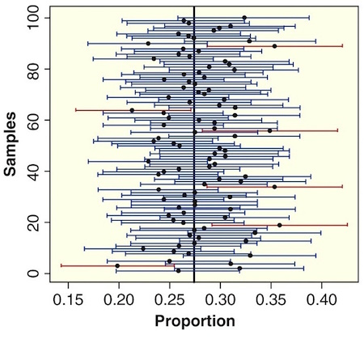

```{r setup, include=FALSE}
knitr::opts_chunk$set(echo = TRUE,message=FALSE,warning=FALSE)
```


```{r, echo=F,message=FALSE}
library(mosaic)
library(Lock5Data)
```


# Interval Estimate

An **interval estimate** gives a range of plausible values for a population parameter.

---

# Margin of Error

* One common form for an interval estimate is  

$$
\text{statistic} \pm \text{margin of error}
$$
where the **margin of error** quantifies the precision of the sample statistic as a *point estimator* of the parameter.  

---

# Using SE to Finding MOE

* **Question** How do we determine the margin of error (MOE)?

* **Answer** Use the *SE* of the sampling distribution.  

---

# Confidence Interval  

* A **confidence interval** for a parameter is an interval computed from *sample data* by a method that will capture the parameter for a *specified proportion* of all samples.

* The success rate is known as the **confidence level**
    + A **95%** confidence interval will contain the true parameter for **95%** of all samples
   
???
Use the sampling distribution part of StatKey with confidence intervals to illustrate for mean and proportion. 

---

## Sampling Distributions and Margins of Error

If you had access to the sampling distribution, how would you find the margin of error to ensure that intervals of the form

$$
\text{statistic} \pm \text{margin of error}
$$

would capture the parameter for 95% of all samples?  

---

# 95% Confidence Interval

If the sampling distribution is relatively symmetric and bell-shaped, a 95% confidence interval can be estimated using

$$
\text{statistic} \pm 2\text{SE}
$$

???
Do some calculations

---

## Interpreting a Confidence Interval

* We say we are **95% confident** or **95% sure** because
    + 95% of all samples yield intervals that contain the true parameter


```{r, out.height ="400px", echo=FALSE}

```

---

# Confidence Interval Misconceptions

**Misinterpretation 1**

* “A 95% confidence interval **contains 95% of the data** in the population.”

--

**Misinterpretation 2**

* “I am 95% sure that the **mean of a sample** will fall within a 95% confidence interval for the mean.”

--

**Misinterpretation 3**

* “The probability that the population parameter is **in this particular 95% confidence interval** is 0.95.”

---

# Summary

To create a 95% confidence interval for a parameter:

1. Take many random samples from the population.

2. Compute the sample statistic for each sample.

3. Compute the standard error (SE) as the standard deviation of these statistics.

4. Compute the interval $\text{statistic}\pm 2\text{SE}$ 

**But there's one small problem...**  

---

# Reality  

* In reality, **we only have one sample!**  


How do we know how much sample statistics vary, if we only have one sample?!?
 

Stay tuned...