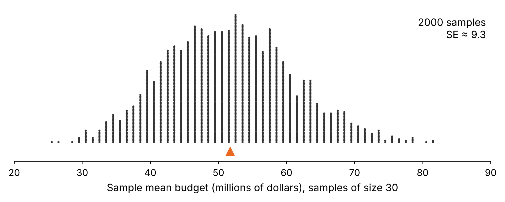
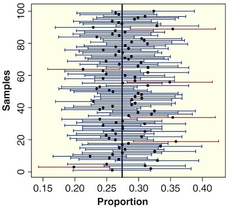

```{r, echo=F,message=FALSE}
library(mosaic)
library(Lock5Data)
```

## Agenda

-   Interval estimate

-   Interval estimate based on margin of error

-   Confidence interval

-   95% confidence interval using the SE

-   Understanding confidence intervals

-   Common misinterpretations

## Interval Estimate

An **interval estimate** gives a range of plausible values for a population parameter.

::: notes
Lead-in to the activity: so far (3.1) we saw that a single sample statistic bounces around from sample to sample. An interval estimate admits that bounce instead of reporting one number.
:::

## Margin of Error

-   One common form for an interval estimate is

$$
\text{statistic} \pm \text{margin of error}
$$ where the **margin of error** quantifies the precision of the sample statistic as a *point estimator* of the parameter.

## Activity: Coin Flipping {.smaller}

Flip a coin **25 times**. Record the number of heads and tails:

<table class="fillin">
<tr><th>Heads</th><th>Tails</th></tr>
<tr><td></td><td></td></tr>
</table>

Sample proportion of heads: $\hat{p} =$ \_\_\_\_\_\_\_\_\_\_\_\_\_

If you did this many, many times, describe the **shape** and **center** of the sampling distribution of sample proportions of heads in 25 flips of a coin.

::: {.ws-l}
:::

::: notes
Have students flip (or use a coin app) and record on the printed handout. Collect each student's $\hat{p}$ on the board or in a quick dotplot while they write.

Answer: roughly symmetric, bell-shaped, centered at the true proportion 0.5. (Spread, for later: SE = sqrt(0.5 * 0.5 / 25) = 0.10, so the 0.20 margin of error on the next slide is exactly 2 SEs.)
:::

## Activity: An Interval Estimate for the Proportion of Heads {.smaller}

Recall: your sample proportion was $\hat{p}$ = \_\_\_\_\_\_\_\_\_.

The margin of error for a sample proportion in this situation is known to be **0.20**. (We'll see how to find this later in the course.)

Use this margin of error to find an interval estimate for the true proportion of heads in flipping a coin.

Interval estimate is: \_\_\_\_\_\_\_\_\_\_\_\_\_\_\_\_ to \_\_\_\_\_\_\_\_\_\_\_\_\_\_\_\_

::: {.ws}
:::

Does your interval estimate contain the true proportion of 0.5? \_\_\_\_\_\_\_\_\_

::: notes
Interval: $\hat{p} \pm 0.20$. For example, $\hat{p}$ = 0.44 gives 0.24 to 0.64, which contains 0.5.

Class tally (do this on the board): how many of our intervals contain 0.5? An interval misses only if the number of heads is 7 or fewer, or 18 or more. For a fair coin the chance an interval captures 0.5 is about 0.957, so in a class of 30 expect roughly 1 or 2 misses. This sets up the "95% of all samples" idea on the next definition slide.

Turn and talk (30 sec, optional): if you had flipped 250 times instead of 25, would you expect your interval to be wider or narrower? Why?
:::

## How MOE Connects to SE {.smaller}

* **Goal:** Pick MOE so
$$
  \text{statistic} \pm \text{MOE}
$$
**captures the unknown parameter about 95% of the time** across many samples.

::: {.fragment}
* **Key idea:**
$$
  \text{MOE} = c \times \text{SE}
$$
  where **(c)** is “how many SEs” you need to go out to cover the **middle 95%** of the sampling distribution.

:::

::: {.fragment}
> Key Point: **MOE isn’t the SE.** It’s **“how many SEs”** you need for ~95% capture.

:::

::: notes
Tie back to the activity: the 0.20 margin of error was 2 SEs, because the SE for 25 flips is 0.10.
:::

## Confidence Interval

-   A **confidence interval** for a parameter is an interval computed from *sample data* by a method that will capture the parameter for a *specified percent* of all samples.

-   The success rate is known as the **confidence level**

    -   A **95%** confidence interval will contain the true parameter for **95%** of all samples

## Example 1: Margin of Error (a, b) {.smaller}

A survey of 1,000 American adults conducted between Sept. 1-17, 2026 found that just 34% "approve of the way the Supreme Court is handling its job." The survey goes on to say that "The margin of sampling error is +/- 4 percentage points with a 95% level of confidence."

a\) What is the relevant sample statistic? Give appropriate notation and the value of the statistic.

::: {.ws}
:::

b\) What population parameter are we estimating with this sample statistic?

::: {.ws}
:::

::: notes
a) $\hat{p} = 0.34$ (34% of the 1,000 sampled adults approve).

b) $p$, the proportion of *all* American adults who approve of the way the Supreme Court is handling its job (at that time).
:::

## Example 1: Margin of Error (c, d) {.smaller}

Recall: $\hat{p} = 0.34$, margin of error = 0.04, 95% confidence.

c\) Use the margin of error to give a confidence interval for the estimate.

::: {.ws}
:::

d\) Is 0.37 a plausible value of the population proportion? Is 0.50 a plausible value?

::: {.ws-l}
:::

::: notes
c) 0.34 ± 0.04 = 0.30 to 0.38 (30% to 38%). We are 95% confident the proportion of all American adults who approve is between 30% and 38%.

d) 0.37 is inside the interval, so it is a plausible value; 0.50 is well outside, so it is not plausible. Point out that "plausible" means "consistent with the data at this confidence level," not "impossible."
:::

## Sampling Distributions and Margins of Error

If you had access to the sampling distribution, how would you find the margin of error to ensure that intervals of the form

$$
\text{statistic} \pm \text{margin of error}
$$

would capture the parameter for 95% of all samples?

::: {.fragment}
**Turn and talk (30–60 sec):** Where on the sampling distribution would you put the cut-offs so that the middle 95% of sample statistics is between them?
:::

## 95% Confidence Interval

Because the middle 95% of symmetric bell-shaped sampling distributions spans about 2 SEs from the center, we define a 95% interval as

$$
\text{statistic} \pm 2\text{SE}
$$

## Example 2: Hollywood Budgets (a) {.smaller}

A sampling distribution is shown for the mean budget (in millions of dollars) of Hollywood movies released in 2018, using samples of size $n = 30$. The standard error is about **9.3**.

{fig-align="center" width="85%"}

a\) What margin of error gives a 95% interval of the form $\bar{x} \pm \text{MOE}$?

::: {.ws}
:::

::: aside
Data: HollywoodMovies2018 (Lock5Data), 2018 releases with a known budget.
:::

::: notes
Margin of error = 2 × SE = 2 × 9.3 = **18.6** million dollars.

Figure: 2,000 random samples of size 30 from the 137 movies released in 2018 that have a budget; each dot is one sample mean. The orange triangle marks the true population mean (51.70). SE from the simulation = 9.3 (Python, not run in R). To reproduce in R:

`mov <- HollywoodMovies2018 |> filter(Year == 2018, !is.na(Budget))`

`sampdist <- do(2000) * mean(~Budget, data = sample(mov, 30))`

`sd(~mean, data = sampdist)`
:::

## Example 2: Hollywood Budgets (b) {.smaller}

Recall: SE = 9.3 and the true mean budget of all 137 movies is **51.70 million dollars**.

b\) Use the SE to find the 95% confidence interval for each sample mean below, and indicate which intervals capture the true mean of 51.70.

<table class="fillin" style="width:100%">
<tr><th style="width:22%">Sample mean</th><th style="width:48%">95% confidence interval</th><th style="width:30%">Captures 51.70?</th></tr>
<tr><td class="lab">$\bar{x} = 40$</td><td></td><td></td></tr>
<tr><td class="lab">$\bar{x} = 65$</td><td></td><td></td></tr>
<tr><td class="lab">$\bar{x} = 75$</td><td></td><td></td></tr>
</table>

::: notes
Margin of error = 2 × 9.3 = 18.6.

- 40: 21.4 to 58.6, captures 51.70.
- 65: 46.4 to 83.6, captures 51.70.
- 75: 56.4 to 93.6, does **not** capture 51.70.

Capture happens exactly when the sample mean is within 2 SEs (18.6) of the truth. 40 is 11.7 away, 65 is 13.3 away, 75 is 23.3 away. In the simulation about 1% of sample means were 75 or more (a rare sample, far in the right tail) and about 3.5% were more than 18.6 from 51.70, in line with "95% of intervals capture."
:::

## Self-Quiz: Constructing CIs {.smaller}

For each of the following, use the information to construct a 95% confidence interval and give notation for the quantity being estimated.

<table class="fillin" style="width:100%">
<tr><th style="width:7%"></th><th style="width:38%">Information</th><th style="width:30%">95% confidence interval</th><th style="width:25%">Quantity estimated</th></tr>
<tr><td class="lab">a)</td><td>$\hat{p} = 0.72$, SE = 0.04</td><td></td><td></td></tr>
<tr><td class="lab">b)</td><td>$\bar{x} = 27$, SE = 3.2</td><td></td><td></td></tr>
<tr><td class="lab">c)</td><td>$\hat{p}_1 - \hat{p}_2 = 0.05$, margin of error for 95% confidence = 0.02</td><td></td><td></td></tr>
</table>

::: notes
a) 0.72 ± 2(0.04) = 0.72 ± 0.08 = **0.64 to 0.80**; estimating $p$.

b) 27 ± 2(3.2) = 27 ± 6.4 = **20.6 to 33.4**; estimating $\mu$.

c) The margin of error is given, so no doubling: 0.05 ± 0.02 = **0.03 to 0.07**; estimating $p_1 - p_2$.

Watch for students doubling the 0.02 in part c.
:::

## Interpreting a Confidence Interval

:::: {.columns}
::: {.column width="48%"}
-   We say we are **95% confident** or **95% sure** because
    -   95% of all samples yield intervals that contain the true parameter

::: {.fragment}
**Turn and talk (30–60 sec):** In the picture, what does each horizontal line represent? What is the vertical line? Why do a few intervals miss it?
:::
:::

::: {.column width="52%"}
{fig-align="center" width="100%"}
:::
::::

## Example 3: Roller Coaster Speeds {.smaller}

A random sample of 30 roller coasters from a worldwide database of 1,207 coasters has a mean top speed of $\bar{x} = 71.3$ km/h. The standard error of the sample mean is about 4.3 km/h.

a\) Find a 95% confidence interval for the mean top speed of the coasters in the database.

::: {.ws}
:::

b\) Clearly interpret the meaning of this confidence interval in context. What is the parameter?

::: {.ws-l}
:::

c\) Is 65 km/h a plausible value for the population mean? Is 85 km/h?

::: {.ws}
:::

::: aside
Data: coasters (math260projdata), Captain Coaster community database. Speed is in km/h.
:::

::: notes
a) 71.3 ± 2(4.3) = 71.3 ± 8.6 = **62.7 to 79.9 km/h**.

b) Parameter: $\mu$, the mean top speed of all coasters in the database (1,207 of them). We are 95% confident that the mean top speed of all the coasters is between 62.7 and 79.9 km/h. Make sure the interpretation is about the **population mean**, not about the 30 sampled coasters and not about individual coasters.

c) 65 km/h is inside the interval, so it is plausible. 85 km/h is above 79.9, so it is not plausible.

Instructor check: the actual mean top speed of all 1,207 coasters is 72.4 km/h, so this interval did capture the truth. SE was found by bootstrapping the sample of 30 (10,000 resamples, Python; not run in R). In class, students are only told the SE.

Common slip: students say "95% of coasters have speeds between 62.7 and 79.9." Individual coasters vary much more (SD of speed is about 27 km/h across the database). This anticipates Misinterpretation 1.
:::

## Example 4: Is the Economy a Top Priority? {.smaller}

A survey of 5,128 Americans in January 2022 found that 71% consider the economy a "top priority" for the president and congress. The standard error for this statistic is 0.006 (or 0.6%).

Find and interpret a 95% confidence interval for the true proportion of all Americans that considered the economy a "top priority" at that time.

::: {.ws}
:::

::: {.ws-l}
:::

::: notes
0.71 ± 2(0.006) = 0.71 ± 0.012 = **0.698 to 0.722** (about 69.8% to 72.2%). We are 95% confident that the proportion of all Americans who considered the economy a top priority in January 2022 is between 69.8% and 72.2%.

Why so narrow compared with the n = 30 coaster example? Big sample, so a small SE. Ask students what would have to change to get the same width with the coasters.
:::

## Confidence Interval Misconceptions

**Misinterpretation 1**

-   “A 95% confidence interval **contains 95% of the data** in the population.”

. . .

**Misinterpretation 2**

-   “I am 95% sure that the **mean of a sample** will fall within a 95% confidence interval for the mean.”

. . .

**Misinterpretation 3**

-   “The probability that the population parameter is **in this particular 95% confidence interval** is 0.95.”

::: notes
Optional Turn and talk (30 sec): which of these three wrong statements did you find most tempting, and why?
:::

## Self-Quiz: Interpreting a CI (a–c) {.smaller}

A survey conducted by the Pew Research Center in June 2023 asked 10,329 U.S. adults whether they believe the federal government should do more to reduce the effects of climate change and 56% agreed that the federal government should do more. The survey reports a margin of error of ±1.5 percentage points with a 95% confidence level, so the 95% confidence interval for the proportion of U.S. adults who believe the federal government should do more about climate change is **54.5% to 57.5%**.

Which of the following statements are correct interpretations? (Select all that apply.)

a\) The true proportion of *all U.S. adults* who believe the federal government should do more about climate change is between 54.5% and 57.5%, with 95% confidence. \_\_\_\_\_\_\_

b\) We are 95% confident that between 54.5% and 57.5% of U.S. adults in *this sample* believe the government should do more about climate change. \_\_\_\_\_\_\_

c\) The confidence interval tells us that 95% of the population believes the federal government should do more about climate change. \_\_\_\_\_\_\_

## Self-Quiz: Interpreting a CI (d, e) {.smaller}

Recall: the 95% confidence interval for the proportion of U.S. adults who believe the federal government should do more about climate change is 54.5% to 57.5%.

d\) If we repeated the survey many times, approximately 95% of the resulting confidence intervals would contain the true population proportion of U.S. adults who believe the federal government should do more about climate change. \_\_\_\_\_\_\_

e\) We are 95% confident that the proportion of U.S. adults who will believe in the future that the government should do more about climate change will fall between 54.5% and 57.5%. \_\_\_\_\_\_\_

::: {.ws}
:::

::: notes
Correct: **a** and **d**.

- a: correct, the standard interpretation (about the population proportion).
- b: wrong, the sample proportion is known exactly (56%); the interval is about the population.
- c: wrong, Misinterpretation 1; 56% (not 95%) is the estimate for the share who agree.
- d: correct, the long-run "95% of all samples" meaning.
- e: wrong, the interval is about the population *now* (when surveyed), not future opinion.

Consider asking students to rewrite one wrong option so it becomes correct.
:::

## Summary

To create a 95% confidence interval for a parameter:

1.  Take many random samples from the population.

2.  Compute the sample statistic for each sample.

3.  Compute the standard error (SE) as the standard deviation of these statistics.

4.  Compute the interval $\text{statistic}\pm 2\text{SE}$

**But there's one small problem...**

## The Problem

-   In reality, **we only have one sample!**

How do we know how much sample statistics vary, if we only have one sample?!?

Stay tuned...

## Summary {.smaller}

-   **Interval Estimate**: Provides a range of plausible values for a population parameter.
-   **Margin of Error (MOE)**: Calculated using the standard error (SE) to quantify precision.
-   **Confidence Interval**: Captures parameter with specified confidence level (e.g., 95%).
-   **Calculation**:
    -  95%  Interval $\Rightarrow \text{statistic} \pm 2\cdot \text{SE}$ for symmetric, bell-shaped distributions.
-   **Misconceptions**:
    -   CI does not contain 95% of the data.
    -   CI is not about the sample mean but the population parameter.
