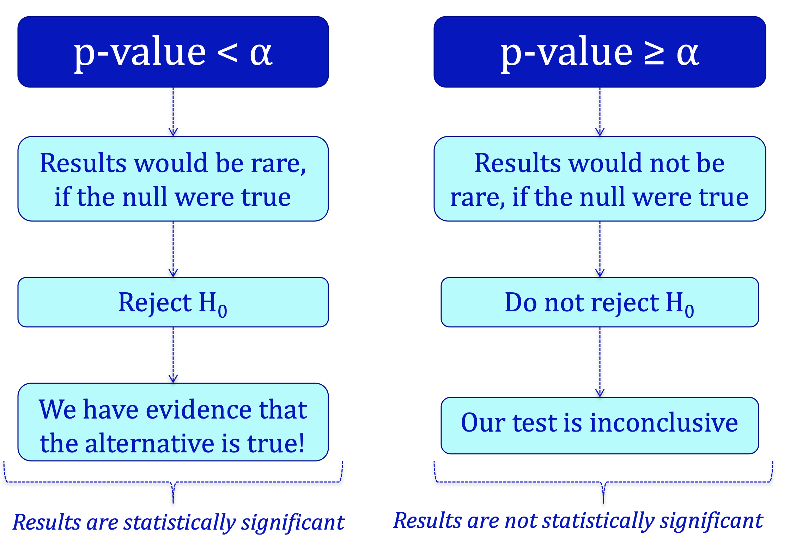
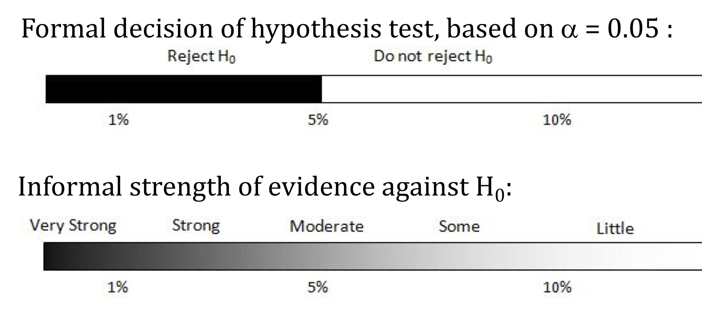

```{r setup, include=FALSE}
knitr::opts_chunk$set(echo = TRUE,message=FALSE,warning=FALSE)
```

```{r xaringan-themer, include=FALSE, warning=FALSE}
library(xaringanthemer)
style_mono_accent(
  base_color = "#1c5253",
  header_font_google = google_font("Josefin Sans"),
  text_font_google   = google_font("Montserrat", "300", "300i"),
  code_font_google   = google_font("Fira Mono")
)
```

```{r, echo=F,message=FALSE}
library(mosaic)
library(Lock5Data)
```


class: middle, center,inverse

# Section 4.3 Determining Statistical Significance  

---

# p-value and $H_0$  

* If the p-value is small, then a statistic as extreme as that observed would be unlikely if the null hypothesis were true, providing significant evidence against $H_0$.

--

* The *smaller* the p-value, the *stronger* the evidence against the null hypothesis and in favor of the alternative.

---

# Formal Decisions

### If the $p$-value is small:

* **Reject $H_0$**
* the sample would be **extreme** if $H_0$ were true
* the results are **statistically significant**
* we have evidence for $H_a$

--

### If the $p$-value is **not** small:

* **Do not reject $H_0$**
* the sample would not be too extreme if $H_0$ were true
* the results are **not statistically significant**
* the test is **inconclusive**; either $H_0$ or $H_a$ may be true

--

But how small is small?

---

# Significance Level

The **significance level $\alpha$** is the  threshold *below* which the $p$-value is deemed small enough to reject the null hypothesis.

+ $p$-value $<\alpha$ $\Longrightarrow$ Reject $H_0$

+ $p$-value $\ge \alpha$ $\Longrightarrow$ Do not reject $H_0$

The most common value of $\alpha$ is .05

* Values of .10 and .01 are also common.
  
---
  
# Significance Level

* $p$-value $<\alpha$ $\Longrightarrow$ Results are **statistically significant**
    + Reject $H_0$ in favor of $H_a$
--


* $p$-value $\ge\alpha$ $\Longrightarrow$ Results are **not statistically significant**
    + Test is inconclusive

---
# Components of a Hypothesis Test

### A formal hypothesis test includes the following components:

1. State the null and alternative hypotheses (defining parameters when necessary).

--

2. Determine the value of the observed sample statistic.

--

3. Find the $p$-value.

--

4. Make a generic decision about $H_0:$ Reject $H_0$ or do not reject $H_0$.

--

5. Write a sentence explaining the conclusion of the test in context, indicating whether or not we have convincing evidence for $H_a$ and referring back to the question of interest.

---
class: middle, center,inverse

# Significance Testing is Controversial

---
background-image: url(https://imgs.xkcd.com/comics/mathematical_symbol_fight.png)

---
class: top

# Moving to a World Beyond $p<0.05$


* [Link](https://doi.org/10.1080/00031305.2019.1583913) to the article 


---

# P-value, Significance Levels, and Decisions



---

# Statistical Conclusions  




---
# Never Accept the Null

* "Do not reject $H_0$" is not the same as "accept $H_0$"!

*  Lack of evidence against $H_0$ is **not** the same as evidence for $H_0$!

---

class: middle, center,inverse

# Section 4.4 A Closer Look at Testing

---


# Type I and Type II Errors

|                |       Reject $H_0$      |   Do not reject $H_0$   |
|----------------|:-----------------------:|:-----------------------:|
| $H_0$ is true  | Type I Error $(\alpha)$ |         No error        |
| $H_0$ is false |         No error        | Type II Error $(\beta)$ |

--

### Type I Error $==>$ False positive   

--
   
### Type II Error $==>$ False negative


---

# Significance Level  

The significance level, $\alpha$, represents the tolerable probability of making a Type I error.  

---

# Multiple Testing

*  When multiple hypothesis tests are conducted, the chance that at least one test incorrectly rejects a true null hypothesis increases with the number of tests.

*  If the null hypotheses are all true, $\alpha$ of the tests will yield statistically significant results just by random chance.

---
background-image: url(https://imgs.xkcd.com/comics/significant.png)
background-position: center
background-size: contain


---

## Publication Bias

* **Publication bias** refers to the fact that usually only the significant results get published.

* The one study that turns out significant gets published, and no one knows about all the insignificant results.

* This combined with the problem of multiple comparisons, can yield very misleading results.


---

## Replicating Results  

By attempting to *replicate* significant results with another study, this second study can either:  

* Reject $H_0$, providing further confirmation that $H_a$ is true 

OR

--

* Fail to reject $H_0$, suggesting that the first study may have yielded a Type I error.

---
  
## Practical vs Statistical Significance

* With small sample sizes, even large differences or effects may not be significant.

* With large sample sizes, even a very small difference or effect can be significant.

* A statistically significant result is not always practically significant, especially with large sample sizes.

